**言語**: [English](README.md) | [简体中文](README.zh-CN.md) | [繁體中文](README.zh-TW.md) | [日本語](README.ja.md) | [한국어](README.ko.md) | [Français](README.fr.md) | [Deutsch](README.de.md) | [Español](README.es.md) | [Italiano](README.it.md) | [Русский](README.ru.md) | [العربية](README.ar.md)

[← ドキュメント索引](../README.ja.md) · [← NeverC プロジェクト](../i18n/README.ja.md)

# NeverC DynCode コンパイラ

C ソースを**位置独立・ゼロリロケーション・ゼロデータセクション**のフラットバイナリ dyncode に直接コンパイルする。

## ガイド

- [ARM64 (AArch64) アセンブリチュートリアル — DynCode の観点から](arm64-assembly-tutorial/README.ja.md)
- [NeverC DynCode クロスプラットフォームアーキテクチャ概要](cross-platform-architecture/README.ja.md)
- [IR パス設計 — 原則、パイプライン、前後比較](ir-pass-design/README.ja.md)
- [カーネルモード（Ring-0）DynCode サポート](kernel-mode-dyncode/README.ja.md)
- [MIR パス設計 — 原則とフックポイント](mir-pass-design/README.ja.md)
- [DynCode パイプライン、MIR、PIC 戦略（設計メモ）](pipeline-and-pic/README.ja.md)
- [プラットフォーム拡張ガイド](platform-extension-guide/README.ja.md)
- [DynCode コンパイラ — 進捗トラッカー](progress/README.ja.md)
- [ロードマップ](roadmap/README.ja.md)

---

## コア目標

1. **通常の C を書くだけ** — dyncode 専用のテクニックは不要。
2. **完全自動パイプライン** — `static int counter = 0`、`const char s[] = "..."`、再帰、`write/exit/read/...`、大きな定数配列などはユーザー側の変更なしで内部処理される。
3. **外部依存ゼロ** — 出力 `.bin` は純粋な命令列で、dyld・libSystem・データセクションを参照しない。
4. **CLI は TableGen 定義** — 各 `-fdyncode-*` は [`neverc/include/neverc/Invoke/Options.td.h`] に登録（ハードコードの文字列一致ではない）。 typo には did-you-mean、`--help` に全オプション。
5. **出力制約は検証可能** — `-fdyncode-bad-bytes=` / `-fdyncode-bad-byte-profile=` は post-extract 後に最終 `.bin` を走査し、禁止バイト命中時はオフセット・バイト・文脈を報告して出力を拒否。
6. **クロスプラットフォーム単一パイプライン** — `TargetDesc` 表で駆動。同一 C ソースから macOS / Linux / Android / Windows 用 dyncode を生成。新規プラットフォームは pass を 5 重化せず、表に 1 行 + 抽出器 1 実装を追加するだけ。

---

## サポートターゲット

| Triple | 形式 | ユーザーモード syscall | Ring-0 リゾルバ | 状態 |
|--------|--------|-------------------|-----------------|--------|
| `arm64-apple-macos*` | Mach-O | `svc #0x80` (Darwin BSD) | `DarwinXNUKextShim` | ネイティブ loader 往復 + カーネルリゾルバ対応 |
| `x86_64-apple-macos*` | Mach-O | `syscall` (BSD class mask `0x2000000`) | `DarwinXNUKextShim` | コンパイル・抽出 OK；x86_64 `__text` は reloc 想定なし |
| `aarch64-linux-gnu` | ELF | `svc #0` (x8 = nr) | `LinuxKallsymsShim` | コンパイル・抽出・カーネルリゾルバ OK |
| `x86_64-linux-gnu` | ELF | `syscall` (rax = nr) | `LinuxKallsymsShim` | コンパイル・抽出・カーネルリゾルバ OK |
| `aarch64-linux-android*` | ELF | Linux arm64 と同じ | `LinuxKallsymsShim` (GKI) | コンパイル・抽出 OK |
| `x86_64-linux-android*` | ELF | Linux x86_64 と同じ | `LinuxKallsymsShim` (GKI) | コンパイル・抽出 OK |
| `aarch64-pc-windows-msvc` | PE/COFF | **PEB ウォーク** (`ldr xN, [x18, #0x60]`) | `WindowsKernelResolverShim` | ユーザーモード PEB 読取バイト `32 40 f9` 検証済；ring-0 は loader リゾルバ |
| `x86_64-pc-windows-msvc` | PE/COFF | **PEB モジュールウォーク + PE エクスポート表** | `WindowsKernelResolverShim` | ユーザーモードは IR レベル PEB ウォーク；ring-0 は PEB を再利用しない |

8 つの (OS, arch) triple は**同一 pass 群**で駆動。差分は `TargetDesc.cpp` の表項と 3 つの抽出器アーキテクチャ分岐に閉じる。新規プラットフォーム = 表に 1 行 + 各抽出器に case 1 つ。`ExecutionLevel` は直交：`User` はユーザーモード syscall / PEB パイプライン、`Kernel` は両方無効化して `KernelImportPass` で extern 呼び出しをリゾルバ shim 経由に書き換え。[kernel-mode-dyncode.md](kernel-mode-dyncode/README.ja.md) 参照。

---

## クイックスタート

```bash
# Always pass -target — output triple is independent of the compiler host.

# 1) Pure computation dyncode — no system calls
neverc -fdyncode -target arm64-apple-macos add.c -o add.bin

# 2) Darwin hello world — write/exit → svc #0x80
neverc -fdyncode -target arm64-apple-macos -mdyncode-syscall hello.c -o hello.bin

# 3) Linux arm64: svc #0 + x8=nr
neverc -fdyncode -target aarch64-linux-gnu -mdyncode-syscall \
       hello.c -o hello_linux_arm64.bin

# 4) Linux x86_64: syscall + rax=nr
neverc -fdyncode -target x86_64-linux-gnu -mdyncode-syscall \
       hello.c -o hello_linux_x64.bin

# 5) Windows x86_64 (PEB walk for API calls)
neverc -fdyncode -target x86_64-pc-windows-msvc \
       -mdyncode-win-peb-import win.c -o win.bin

# 6) Custom entry symbol
neverc -fdyncode -target arm64-apple-macos -fdyncode-entry=dyncode_main kernel.c -o k.bin

# 7) Keep intermediate object for audit (otool / llvm-objdump / dumpbin)
neverc -fdyncode -target arm64-apple-macos -fdyncode-keep-obj=/tmp/dump.obj x.c -o x.bin

# 8) Reject forbidden bytes in final .bin
neverc -fdyncode -target arm64-apple-macos -fdyncode-bad-bytes=00,0a,0d x.c -o x.bin

# 9) Built-in bad-byte profile (same as forbidding 00/0a/0d)
neverc -fdyncode -target arm64-apple-macos -fdyncode-bad-byte-profile=http-newline x.c -o x.bin

# 10) Run on macOS (platform-specific loader)
./loader_arm64_macos add.bin 3 4   # exit code = 7

# 11) Verbose extractor summary
neverc -v -fdyncode -target arm64-apple-macos fib.c -o fib.bin
#   dyncode-extractor: wrote 64 bytes to 'fib.bin'
#   dyncode-extractor: target   = arm64-apple-macos (Mach-O)
#   dyncode-extractor: entry symbol = _main
#   dyncode-extractor: patched 1 BRANCH26, 0 PAGE21, 0 PAGEOFF12 intra-section reloc(s)
```

---

## CLI オプション（すべて `Options.td.h` で定義）

| オプション | 説明 |
|--------|-------------|
| `-fdyncode` | dyncode コンパイルモードを有効化。 |
| `-fno-dyncode` | 直前の `-fdyncode` を取り消す。 |
| `-fdyncode-all-blr` | 積極モード：モジュール内直接呼び出しを `blr xN` / `call *rax` に間接化し相対分岐 reloc を全除去。通常は不要。 |
| `-mdyncode-syscall` | syscall stub を明示有効化（Darwin/Linux/Android では `-fdyncode` 時デフォルト。意図表明・スクリプト互換用）。 |
| `-mdyncode-libsystem` | `-mdyncode-syscall` の Darwin レガシー別名。 |
| `-mdyncode-win-peb-import` | Windows PEB インポートを明示有効化（`-fdyncode` + Windows triple でデフォルト）。 |
| `-fdyncode-keep-obj=<path>` | 中間オブジェクトを `<path>` にコピーしネイティブ逆アセンブラで監査。 |
| `-fdyncode-entry=<name>` | デフォルト入口名を上書き。`main` / `_main` / `dyncode_entry` / `_dyncode_entry` を受理。 |
| `-fdyncode-bad-bytes=<hex-list>` | 禁止バイトのカンマ区切りリスト（例 `00,0a,0d`）。post-extract 後に最終 `.bin` を走査；命中時は失敗しファイルは書かない。 |
| `-fdyncode-bad-byte-profile=<name>` | 組み込み禁止バイトプロファイル：`null`、`c-string`、`http-newline`、`line`、`whitespace`、`ascii-control`。`-fdyncode-bad-bytes=` と併用可。 |
| `-fdyncode-obfuscate=<spec>` | [Plugin API](../plugin-api/README.ja.md) 経由で登録された **IR レベル**プラグインフックへ渡す。プラグイン未ロード時は no-op。[ir-pass-design.md §9 — Obfuscation Interposes](ir-pass-design/README.ja.md#9-obfuscation-interposes)。 |
| `-fdyncode-mir-obfuscate=<spec>` | **MIR レベル**難読化フック（`RunBeforePreEmit` / `RunAfterPreEmit`）へ渡す。未設定時は `-fdyncode-obfuscate=` にフォールバック。[mir-pass-design.md §3 — User Obfuscation Interposes](mir-pass-design/README.ja.md#3-ユーザー難読化フック)。 |

---

## アーキテクチャ概要

パイプラインは**ターゲット非依存 IR pass + ターゲット固有抽出器**に分かれる：

```mermaid
flowchart TD
    Driver["neverc -fdyncode · OptTable + Options.td.h"]
    Frontend["C23 Frontend · PIC default"]
    Driver -->|describeTriple| Frontend
    Frontend -->|LLVM IR| ZRP

    subgraph IR["Target-Independent IR Passes"]
        direction TB
        ZRP["① ZeroRelocPass — Prep\ninternal + always_inline\nreject ctors / thread_local / extern_weak"]
        IBP["② IndirectBrPass\ncomputed-goto → switch"]
        SSP["③ SyscallStubPass\nlibc → svc #0x80 / svc #0 / syscall"]
        WPP["④ WinPEBImportPass\nextern Win32 API → PEB-walk thunk"]
        MIP["⑤ MemIntrinPass\nmemcpy/memset/str* → byte-loop"]
        CRP["⑥ CompilerRtPass\ni128 div/mod → inline long-division"]
        D2T1["⑦ Data2TextPass — Phase 1\nconst GV → stack stores"]
        ZRP --> IBP --> SSP --> WPP --> MIP --> CRP --> D2T1
    end

    Backend["AArch64 / X86 Backend\nSROA · InstCombine · AlwaysInliner · SLP"]
    D2T1 --> Backend

    Backend --> D2T2
    subgraph Post["Post-Backend IR"]
        direction TB
        D2T2["⑧ Data2TextPass — Phase 2\nvector const split"]
        ZRS["⑨ ZeroRelocPass — Stackify\nglobals → entry alloca"]
        ABP["⑩ AllBlrPass (optional)\ndirect call → indirect call"]
        D2T2 --> ZRS --> ABP
    end

    Codegen["Codegen · IR → MIR → Register Allocation"]
    ABP --> Codegen

    Codegen --> MH1
    subgraph MIR["MIR Layer"]
        direction TB
        MH1["⑪ RunBeforePreEmit interpose"]
        MIRP["⑫ DynCodeMIRPrepPass\nstrip CFI / EH_LABEL / XRay / StackMap"]
        MH2["⑬ RunAfterPreEmit interpose\ninstruction-level obfuscation entry"]
        MH1 --> MIRP --> MH2
    end

    MH2 -->|"Mach-O / ELF / COFF .o"| Extractor

    subgraph Extract["Extractor Layer"]
        Extractor["DynCodeExtractor\nMachO · ELF · COFF\npatch intra-.text relocs\nreject external reloc / data section\nbad-byte audit"]
    end

    Extractor --> Output(["flat .bin dyncode"])
```



## 表駆動のプラットフォーム差分

[`neverc/include/neverc/DynCode/Pipeline/TargetDesc.h`] は各 (OS, arch) の差分を記述する `TargetDesc` 構造体を定義する：

- `TextSectionName`: Mach-O `__text` / ELF `.text` / COFF `.text`
- `SyscallABI`: enum value (`DarwinSvc80` / `LinuxSvc0` / `LinuxSyscall` / `WindowsPEB` / `None`)
- `AsmTemplate`: `svc #0x80` / `svc #0` / `syscall`
- `SyscallNumberReg`: x16 / x8 / rax
- `SyscallRetReg`: x0 / rax
- `ArgRegs`: ordered list of platform ABI argument registers + count
- `TCBReadAsm` / `TCBReadConstraint`: inline-asm single-instruction template for reading TEB/PEB pointer (Windows x86_64 = `movq %gs:0x60, $0`, Windows arm64 = `ldr $0, [x18, #0x60]`). `WinPEBImportPass` reads directly from the table.
- `DriverInjectFlags`: platform-specific driver flags as a null-terminated static array (x86_64 Unix gets `-fpic -mcmodel=small`; Windows gets `-mno-stack-arg-probe` / `/GS-`). `perTargetInjectFlags` reads from the table.

SyscallStubPass と WinPEBImportPass は TargetDesc フィールドから InlineAsm を生成。バックエンドは TableGen 定義の命令パターンを使用。新ターゲット = `describeTriple` に**1 行**、各抽出器 switch に**case 1 つ**。

## 抽出器レイヤ

| 形式 | 実装 | パッチ可能なセクション内 reloc |
|--------|---------------|-------------------------------------|
| Mach-O | `MachOExtractor.cpp` | arm64: `ARM64_RELOC_BRANCH26` / `PAGE21` / `PAGEOFF12`; x86_64: `X86_64_RELOC_SIGNED` / `SIGNED_1/2/4` / `BRANCH` (intra-`__text` pcrel32); `UNSIGNED` / `GOT_LOAD` / `GOT` / `SUBTRACTOR` / `TLV` rejected |
| ELF | `ELFExtractor.cpp` | arm64: `R_AARCH64_CALL26` / `JUMP26` / `ADR_PREL_PG_HI21(_NC)` / `ADD_ABS_LO12_NC` / `LDST{8,16,32,64,128}_ABS_LO12_NC` / `PREL32`; x86_64: `R_X86_64_PC32` / `PLT32` (`GOTPCREL` rejected) |
| COFF | `COFFExtractor.cpp` | arm64: `IMAGE_REL_ARM64_BRANCH26` / `PAGEBASE_REL21` / `PAGEOFFSET_12A` / `PAGEOFFSET_12L` / `REL32`; x86_64: `IMAGE_REL_AMD64_REL32` / `REL32_[1-5]` |

その他の型やセクション間 reloc はヒント付きでハード失敗（libc 推測 → syscall stub / `_Complex` → 手動 struct / リテラルプール後端フォールバック等）。

---

## ユーザーコード能力マトリクス

| シナリオ | ユーザーコード | 対応 | 仕組み |
|----------|-----------|-----------|-----------|
| 整数・ビット演算 | `int f(int a) { return a*3+1; }` | はい | 純命令列 |
| 再帰・ループ | `int fib(int n) { ... }` | はい | `static` + always_inline |
| `switch / case` | `switch (op) { case 0: ... }` | はい | ドライバが `-fno-jump-tables` を注入 |
| 構造体値渡し | `struct Vec3 v = {...}; dot(v);` | はい | スタック化 + always_inline |
| 浮動小数点 | `double y = x * 3.14;` | はい | Data2Text が ConstantFP を volatile ロードのビットパターンに |
| 小さな定数配列 | `const int t[4] = {1,2,3,4};` | はい | Data2Text がスタック化 |
| 大きな定数配列 (256B+) | `const unsigned char tbl[256] = {...}` | はい | Data2Text、サイズ制限なし |
| 文字列リテラル | `const char s[] = "hi\n";` | はい | Data2Text がスタック化 |
| `memcpy` / `memset` / `memmove` / `memcmp` | `memcpy(dst, src, n);` | はい | MemIntrinPass バイトループラッパ |
| `strlen` / `strcpy` / `strcmp` 等 | `strlen(buf);` | はい | MemIntrinPass バイトループラッパ |
| `__int128` 除算・剰余 | `u128 q = a / b;` | はい | CompilerRtPass インライン長除算 |
| `_Atomic` / `__atomic_*` / `__sync_*` | `__atomic_fetch_add(&c, 1, ...)` | はい | インライン LDXR/STXR (arm64) / LOCK (x86_64) |
| `__builtin_*` 系 | `__builtin_popcount(x)` | はい | バックエンド単一命令選択 |
| VLA / 可変長配列 / 複合リテラル | 通常の C99/C11 | はい | `-fno-jump-tables` + Data2Text |
| 変更可能グローバル | `static int counter = 0;` | はい | ZeroReloc がスタック化 |
| libc write/exit | `write(1, s, 3);` | はい（`-mdyncode-syscall`） | Syscall ラッパ |
| POSIX インクルード | `#include <unistd.h>` | はい（dyncode モードで shim に自動切替） | ドライバが `__NEVERC_DYNCODE__` を注入 |
| Win32 API | `WriteFile(h, buf, n, &w, 0);` | はい（`-mdyncode-win-peb-import`） | PEB ウォーク thunk |
| Windows SDK インクルード | `#include <windows.h>` | はい（dyncode モードで shim） | 軽量 shim ヘッダ |
| カスタム入口名 | `int dyncode_main(...)` | はい（`-fdyncode-entry=...`） | ドライバ透過 |
| グローバルコンストラクタ | `__attribute__((constructor))` | いいえ | 実行時に起動する仕組みなし |
| TLS / thread_local | `thread_local int x;` | static に自動降格 | ZeroRelocPass.Prep が静かに降格 |
| C++ / ObjC | — | いいえ | プロジェクトは C のみ |

---

## ディレクトリ構造

```
neverc/
├── include/neverc/Invoke/Options.td.h           # -fdyncode-* TableGen definitions
├── include/neverc/DynCode/                  # Headers (organized by subsystem)
│   ├── Pipeline/                              # Pipeline / driver integration
│   │   ├── Pipeline.h                         # IR + MIR interpose registration
│   │   ├── DriverIntegration.h
│   │   ├── TargetDesc.h                       # Platform table / descriptors
│   │   ├── DynCodeOptions.h                 # Cross-subsystem config
│   │   ├── Diagnostics.h                      # Cross-subsystem diagnostics
│   │   └── SymbolNames.h                      # Cross-subsystem symbol utilities
│   ├── Extractor/
│   │   └── DynCodeExtractor.h
│   ├── IR/                                    # IR-level passes and ABIs
│   │   ├── ZeroRelocPass.h / ZeroRelocABI.h
│   │   ├── Data2TextPass.h / Data2TextABI.h
│   │   ├── AllBlrPass.h / IndirectBrPass.h
│   │   ├── MemIntrinPass.h                    # memcpy/memset/str* inlining
│   │   ├── StringRuntimePass.h / StringRuntimeABI.h
│   │   ├── HeapArenaPass.h                    # malloc/free → arena + OS fallback
│   │   ├── MmapABI.h                          # 共有 mmap 定数 (prot/flags)
│   │   ├── DynCodeIRHelpers.h               # 共通 IR ユーティリティ (getSizeType 等)
│   │   ├── ExternRewriter.h                   # Extern function rewrite utilities
│   │   └── CompilerRtPass.h                   # __int128 division inline
│   ├── MIR/
│   │   └── MIRPrepPass.h                      # Catch-all MachineFunctionPass
│   ├── Import/                                # User-mode + kernel-mode import resolution
│   │   ├── SyscallStub.h / SyscallTables.h
│   │   ├── WinPEBImport.h / WinImportTables.h
│   │   ├── KernelImportPass.h / KernelImportABI.h
│   │   └── PtrCacheHelpers.h                  # Shared address cache encryption helpers
│   └── Tables/                                # User-extensible .def tables
├── lib/DynCode/                             # Implementation (mirrors header structure)
│   ├── Pipeline/ Extractor/ IR/ MIR/ Import/
└── lib/Invoke/Core/Driver.cpp

tests/neverc/                                   # Tests (GTest)
├── DynCodeTests.cpp                         # Core dyncode round-trip tests
├── DynCodeStressTests.cpp                   # Stress tests (VLA, __sync_*, __int128, etc.)
├── DynCodeCrossTargetTests.cpp              # Cross-target compile-only smoke tests
├── dyncode/
│   ├── loader_arm64_macos.c / loader_linux.c / loader_windows.c
│   └── test_dyncode_*.c

docs/dyncode-compiler/
├── README.md                                  ← 英語版
├── README.ja.md                               ← 日本語
├── arm64-assembly-tutorial/README.md
├── cross-platform-architecture/README.md
├── ir-pass-design/README.md
├── kernel-mode-dyncode/README.md
├── mir-pass-design/README.md
├── pipeline-and-pic/README.md
├── platform-extension-guide/README.md
├── progress/README.md
└── roadmap/README.md
```

---

## 前提条件（クロスプラットフォーム）

1. dyncode ロードアドレスは 4 KB アライメント必須 — `mmap` / `VirtualAlloc` の自然な挙動；loader は既に準拠。
2. 呼び出し規約はターゲット OS のネイティブ ABI に従う：
   - Darwin / Linux / Android: System V AMD64 or AAPCS64
   - Windows: Win64 (rcx/rdx/r8/r9)
3. i-cache flush (arm64) / FlushInstructionCache (Windows) は loader の責務。

## 難読化とプラグイン拡張

dyncode パイプライン自体は「コードが正しく動く」ことのみ保証する。難読化・多態化・段階的エンコーダなど戦略層の機能は**意図的に組み込まれておらず**、[Plugin API](../plugin-api/README.ja.md) を通じてツリー外プラグインとして提供される。

パイプラインは 3 層にわたる **11 個のフックポイント**を公開し、すべて C Plugin API（`NEVERC_INTERPOSE_SC_*`）経由でアクセスできる：

**IR 層（6 フック）**：
- `NEVERC_INTERPOSE_SC_BEFORE_PREP` — いかなる dyncode pass より前
- `NEVERC_INTERPOSE_SC_AFTER_PREP` — リンク属性統一（internal + always_inline）
- `NEVERC_INTERPOSE_SC_BEFORE_INLINING` — AlwaysInliner 前の最後の機会
- `NEVERC_INTERPOSE_SC_AFTER_INLINING` — IR が 1 つの大関数に圧縮された後
- `NEVERC_INTERPOSE_SC_AFTER_STACKIFY` — 最終 IR 形状、次はコード生成
- `NEVERC_INTERPOSE_SC_AFTER_FINAL_IR` — AllBlrPass 後、真の最終 IR フック

**MIR 層（3 フック）**：
- `NEVERC_INTERPOSE_SC_BEFORE_PREEMIT` — レジスタ割当済、**CFI/EH 疑似命令は残存**
- `NEVERC_INTERPOSE_SC_AFTER_PREEMIT` — **組み込み MIRPrepPass が疑似命令を除去済**、AsmPrinter が見るバイト列に最も近い；命令レベル難読化・レジスタ改名に最適
- `NEVERC_INTERPOSE_SC_AFTER_FINAL_MIR` — LLVM `addPreEmitPass2()` 後、AsmPrinter 直前の真の最終 MIR フック

**バイトストリーム層（2 フック）**：
- `NEVERC_INTERPOSE_SC_POST_EXTRACT` — 抽出器が .text 内 reloc パッチとデータセクション監査を完了後、`.bin` 書込前。ペイロード全体の暗号化・ジャンクバイト・カスタムヘッダ用。
- `NEVERC_INTERPOSE_SC_POST_FINALIZE` — 全 finalize 後；NeverC はこれ以上監査しない。

フックの完全な一覧、pass 登録、コード例は [Plugin API ドキュメント](../plugin-api/README.ja.md) を参照。

- IR 層：[ir-pass-design.md §9 — Obfuscation Interposes](ir-pass-design/README.ja.md#9-obfuscation-interposes).
- MIR 層：[mir-pass-design.md §3 — User Obfuscation Interposes](mir-pass-design/README.ja.md#3-ユーザー難読化フック)

---

## 現在の制限

- **8 種の (OS, arch) をサポート**（上表）。その他の triple（RISC-V、PowerPC、32 ビット x86、ビッグエンディアン ARM 等）は `describeTriple()` で拒否し、サポート一覧をヒント表示。各行に独立した `User` / `Kernel` があり、計 16 (OS, arch, level) バリアント。
- **Windows PEB ウォークはマルチ DLL ディスパッチで完全実装**。`__neverc_win_resolve` は `(dll_hash, api_hash)` を受け取る。ホワイトリストは kernel32.dll（約 125 API）、ntdll.dll（約 26）、user32.dll（約 13）、ws2_32.dll（約 23）、advapi32.dll（約 16）、shell32.dll（約 6）。API 追加 = `Tables/Win32Apis.def` 1 行 + `lib/Headers/windows.h` 1 宣言。
- **外部関数ホワイトリスト**は Darwin BSD / Linux / Android の主要 syscall（約 80+）と Win32 API（約 190）のみ。stdio 等の重いランタイムは非対応 — dyncode に stdio 状態機械全体は埋め込めない。
- C++ / ObjC / CUDA 非対応 — NeverC は設計上 C のみ。

[`neverc/include/neverc/DynCode/Pipeline/TargetDesc.h`]: ../../neverc/include/neverc/DynCode/Pipeline/TargetDesc.h
[`neverc/include/neverc/Invoke/Options.td.h`]: ../../neverc/include/neverc/Invoke/Options.td.h
