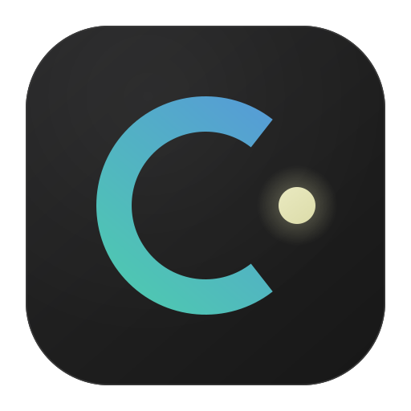

**Языки**: [English](../../README.md) | [简体中文](README.zh-CN.md) | [繁體中文](README.zh-TW.md) | [日本語](README.ja.md) | [한국어](README.ko.md) | [Français](README.fr.md) | [Deutsch](README.de.md) | [Español](README.es.md) | [Italiano](README.it.md) | [Русский](README.ru.md) | [العربية](README.ar.md)

<div align="center">



# NeverC

**ИИ-дружественный компилятор C23 для исследований безопасности — на базе LLVM**

Встроенный линкер · Конвейер dyncode · Встроенные среды выполнения (`string` · `mimalloc` · `xorstr` · `strhash`)

[](../../LICENSE)
[](#возможности)

[](#возможности)

[Документация](../README.ru.md) · [Руководство dyncode](../dyncode-compiler/README.ru.md) · [Встроенные среды выполнения](../builtins/README.ru.md) · [API плагинов](../plugin-api/README.ru.md) · [Дорожная карта](../roadmap/README.ru.md)

</div>

---

> **Примечание:** GitHub всегда показывает на главной репозитория `README.md` (английский), без автоопределения языка браузера. Используйте ссылки языков выше; в [документации](../README.ru.md) и [руководстве dyncode](../dyncode-compiler/README.ru.md) сохраняйте ту же локаль через языковую панель и хлебные крошки.

## Обзор

NeverC компилирует стандартный C в hosted-бинарники, freestanding-исполняемые файлы и позиционно-независимый dyncode — всё из одной цепочки инструментов. Поддерживаются **x86_64** и **AArch64** (только little-endian). В будущих версиях будут добавлены **EVM** (смарт-контракты Ethereum) и **Solana eBPF** (ончейн-программы) как цели компиляции.

## Почему NeverC?

C уже является простейшим системным языком. NeverC делает его ещё проще:

- **Чистый C23, ничего лишнего** — Никаких шаблонов, RAII, перегрузки операторов или скрытого потока управления. Что читаете — то и выполняется.
- **Встроенный `string`** — Строковый тип с семантикой значения, `+`, `==`, `.starts_with()` и автоматическим освобождением — без C++.
- **Никаких исключений** — Обработка ошибок всегда явная. Никакой раскрутки стека, никаких сюрпризов производительности.
- **Единый бинарник** — Компилятор + линкер + среды выполнения в одном исполняемом файле. Ноль внешних зависимостей.
- **Дружественный к LLM** — Минимальная грамматика и детерминированная семантика означают, что ИИ-сгенерированный код NeverC компилируется корректно чаще, чем альтернативы на C++.
- **Настоящая кросс-компиляция** — Собирайте Windows PE, Linux ELF, macOS Mach-O, Android ELF и dyncode из macOS или Linux — без VM, без двойной загрузки, без поиска SDK. SDK платформ встроены в компилятор.
- **Расширяемый без порога вхождения** — Единственный C-заголовок, 130 именованных фаз компиляции — и у вас [плагин компилятора](../plugin-api/README.ru.md), способный вмешаться на любом этапе от оптимизации IR до финального бинарного вывода — без знания LLVM.
- **Исследование безопасности встроено** — Компиляция dyncode, шифрование строк во время компиляции и кроссплатформенная генерация PE нативно встроены в компилятор, а не прикручены постфактум внешними скриптами.

## Возможности

- **[Компилятор dyncode](../dyncode-compiler/README.ru.md)** — многоступенчатый конвейер IR/MIR, кроссплатформенное извлечение, разрешение импортов/syscall, режим ядра, аудит запрещённых байт, архитектура плагинов
- **Интегрированный линкер** — COFF, ELF и Mach-O в одном бинарнике; внешние `ld` и `link.exe` не нужны
- **Кросс-компиляция** — Windows PE, Linux ELF, macOS Mach-O и Android ELF с любого хоста со встроенными SDK платформ
- **[Встроенные среды выполнения](../builtins/README.ru.md)** — встроенные в компилятор LLVM bitcode среды: [`string`](../builtins/string/README.ru.md) (строковый тип с семантикой значения, автоуправление памятью), [`mimalloc`](../builtins/mimalloc/README.ru.md) (прозрачная замена аллокатора высокой производительности), [`xorstr`](../builtins/xorstr/README.ru.md) (шифрование строк во время компиляции с дешифровкой против сигнатур) и [`strhash`](../builtins/strhash/README.ru.md) (хеширование строк на этапе компиляции с тем же алгоритмом во время выполнения)
- **[API плагинов](../plugin-api/README.ru.md)** — чистый C ABI для внедеревных плагинов; SDK с одним заголовком, ноль зависимостей LLVM/CRT, охватывающий фазы драйвера, препроцессора, AST, IR, MIR, MC, объектного файла, компоновки, LTO и dyncode
- **[Расширение `.nc`](../nc-extension/README.ru.md)** — используйте `.nc` для автоматического включения всех возможностей NeverC (`string`, целочисленные типы в стиле Rust) без дополнительных флагов
- **Облегчённая сборка LLVM** — только бэкенды x86_64 / AArch64; пути C++/ObjC/OpenMP удалены

## Быстрый пример

```c
#include <stdio.h>

typedef struct { string user; string pass; } creds;

int main(void) {
    string msg = "Hello " + "NeverC!";
    printf("%s\n", msg.c_str());

    // Compile-time encryption — `strings ./bin` cannot find these literals
    creds login = {.user = "admin".encrypt(), .pass = "s3cret".encrypt()};
    string paths[] = {"/api/v1".encrypt(), "/api/v2".encrypt()};

    // Zero-allocation decrypt-and-compare (plaintext never fully in memory)
    if (login.user == "admin".encrypt() && login.pass == "s3cret".encrypt()) {
        for (int i = 0; i < 2; i++)
            if (msg.starts_with(paths[i]))
                printf("route matched: %s\n", paths[i].c_str());
    }
    return 0;
}
```

> **Примечание:** Встроенный тип **`string`** требует **`-fbuiltin-string`** для файлов `.c`. Он автоматически включается для [**файлов `.nc`**](../nc-extension/README.ru.md) и в режиме **`-fdyncode`**.

```bash
# macOS arm64 / x86_64
neverc -fdyncode -target arm64-apple-macos hello.c -o hello.bin
neverc -fdyncode -target x86_64-apple-macos hello.c -o hello.bin

# iOS arm64
neverc -fdyncode -target arm64-apple-ios hello.c -o hello.bin

# Linux x86_64 / arm64
neverc -fdyncode -target x86_64-linux-gnu hello.c -o hello.bin
neverc -fdyncode -target aarch64-linux-gnu hello.c -o hello.bin

# Android arm64 / x86_64
neverc -fdyncode -target aarch64-linux-android hello.c -o hello.bin
neverc -fdyncode -target x86_64-linux-android hello.c -o hello.bin

# Windows x86_64 / arm64
neverc -fdyncode -target x86_64-pc-windows-msvc hello.c -o hello.bin
neverc -fdyncode -target aarch64-pc-windows-msvc hello.c -o hello.bin
```

Подробности: **[индекс документации](../README.ru.md)** — дизайн, матрица платформ, справочник CLI, примеры. Полные собираемые примеры: **[examples](../examples/README.ru.md)**.

## Сборка

Требования, команды сборки, готовые бинарники macOS, кросс-компиляция под Windows, настройка PATH и конфигурация среды — см. **[Локальная разработка](../local-dev/README.ru.md)**.

## Участие в разработке

Ветка разработки по умолчанию — **`dev`**. Перед началом работы клонируйте репозиторий и переключитесь на `dev`; pull request отправляйте в `dev`.

```bash
git clone https://github.com/NeverSight/NeverC.git
cd NeverC
git checkout dev
```

## Лицензия

[AGPL-3.0](../../LICENSE)

Компоненты LLVM сохраняют лицензию [Apache-2.0 WITH LLVM-exception](../../llvm/LICENSE.TXT).
