<div dir="rtl">

**اللغات**: [English](README.md) | [简体中文](README.zh-CN.md) | [繁體中文](README.zh-TW.md) | [日本語](README.ja.md) | [한국어](README.ko.md) | [Français](README.fr.md) | [Deutsch](README.de.md) | [Español](README.es.md) | [Italiano](README.it.md) | [Русский](README.ru.md) | [العربية](README.ar.md)

[← فهرس التوثيق](../README.ar.md) · [← مشروع NeverC](../../README.ar.md)

# NeverC — مُجمِّع shellcode

يُحوِّل مصدر C مباشرةً إلى shellcode ثنائي مسطح **مستقل عن الموضع، بلا إعادة تموضع، بلا قسم بيانات**.

---

## الأهداف الأساسية

1. **اكتب C عاديًا** — دون حيل خاصة بـ shellcode.
2. **مسار تلقائي بالكامل** — `static int counter = 0` و`const char s[] = "..."` والدوال العودية و`write/exit/read/...` والمصفوفات الثابتة الكبيرة تُعالَج داخليًا دون تعديل كود المستخدم.
3. **صفر تبعيات خارجية** — المخرج `.bin` تيار تعليمات خالص بلا dyld أو libSystem أو قسم بيانات.
4. **خيارات CLI عبر TableGen** — كل `-fshellcode-*` في `neverc/include/neverc/Invoke/Options.td.h` (لا مطابقة نصوص صلبة). الأخطاء الإملائية → did-you-mean؛ `--help` يعرض الكل.
5. **قيود المخرجات قابلة للتحقق** — `-fshellcode-bad-bytes=` / `-fshellcode-bad-byte-profile=` يفحصان `.bin` النهائي بعد post-extract ويرفضان المخرجات عند البايتات المحظورة مع الإزاحة والبايت والسياق.
6. **مسار واحد متعدد المنصات** — يقوده جدول `TargetDesc`. نفس مصدر C لـ macOS / Linux / Android / Windows. منصة جديدة = صف في الجدول + مُستخرج واحد، لا تكرار خمس مجموعات passes.

---

## الأهداف المدعومة

| Triple | الصيغة | syscall وضع المستخدم | محلل Ring-0 | الحالة |
|--------|--------|-------------------|-----------------|--------|
| `arm64-apple-macos*` | Mach-O | `svc #0x80` (Darwin BSD) | `DarwinXNUKextShim` | Native loader round-trip + kernel resolver covered |
| `x86_64-apple-macos*` | Mach-O | `syscall` (BSD class mask `0x2000000`) | `DarwinXNUKextShim` | Compile + extract passing; x86_64 `__text` has no reloc expectation |
| `aarch64-linux-gnu` | ELF | `svc #0` (x8 = nr) | `LinuxKallsymsShim` | Compile + extract + kernel resolver passing |
| `x86_64-linux-gnu` | ELF | `syscall` (rax = nr) | `LinuxKallsymsShim` | Compile + extract + kernel resolver passing |
| `aarch64-linux-android*` | ELF | Same as Linux arm64 | `LinuxKallsymsShim` (GKI) | Compile + extract passing |
| `x86_64-linux-android*` | ELF | Same as Linux x86_64 | `LinuxKallsymsShim` (GKI) | Compile + extract passing |
| `aarch64-pc-windows-msvc` | PE/COFF | **PEB walk** (`ldr xN, [x18, #0x60]`) | `WindowsKernelResolverShim` | User-mode PEB read byte sentinel `32 40 f9` validated; ring-0 uses loader resolver |
| `x86_64-pc-windows-msvc` | PE/COFF | **PEB module walk + PE export-table lookup** | `WindowsKernelResolverShim` | User-mode resolver is full IR-level PEB walk; ring-0 does not reuse PEB |

الثمانية triples (OS, arch) تُشغَّل جميعها بـ **نفس مجموعة الـ passes**. الاختلافات معزولة في صفوف `TargetDesc.cpp` وثلاث فروع للمُستخرجات. منصة جديدة = صف إضافي في الجدول + case في كل مُستخرج. بُعد `ExecutionLevel` متعامد: `User` يستخدم مسار syscall / PEB في وضع المستخدم؛ `Kernel` يعطّل الاثنين ويحقن `KernelImportPass` لإعادة كتابة استدعاءات extern عبر shims. راجع [kernel-mode-shellcode.md](kernel-mode-shellcode/README.ar.md).

---

## بدء سريع

```bash
# 1) Pure computation shellcode — no system calls (defaults to macos arm64)
neverc -fshellcode add.c -o add.bin

# 2) libSystem hello world — auto-replaces write/exit with svc #0x80
neverc -fshellcode -mshellcode-syscall hello.c -o hello.bin

# 3) Cross-compile to Linux arm64: svc #0 + x8=nr
neverc -fshellcode -target aarch64-linux-gnu -mshellcode-syscall \
       hello.c -o hello_linux_arm64.bin

# 4) Cross-compile to Linux x86_64: syscall + rax=nr
neverc -fshellcode -target x86_64-linux-gnu -mshellcode-syscall \
       hello.c -o hello_linux_x64.bin

# 5) Cross-compile to Windows x86_64 (requires PEB walk for API calls)
neverc -fshellcode -target x86_64-pc-windows-msvc \
       -mshellcode-win-peb-import win.c -o win.bin

# 6) Custom entry symbol name (cross-platform)
neverc -fshellcode -fshellcode-entry=shellcode_main kernel.c -o k.bin

# 7) Keep intermediate object file for audit with otool / llvm-objdump / dumpbin
neverc -fshellcode -fshellcode-keep-obj=/tmp/dump.obj x.c -o x.bin

# 8) Forbid null / CR / LF in output; compilation fails if hit, .bin not written
neverc -fshellcode -fshellcode-bad-bytes=00,0a,0d x.c -o x.bin

# 9) Use built-in profile; equivalent to forbidding 00/0a/0d
neverc -fshellcode -fshellcode-bad-byte-profile=http-newline x.c -o x.bin

# 10) Run (macOS loader does MAP_JIT + RWX + i-cache flush)
./loader_arm64_macos add.bin 3 4   # exit code = 7

# 11) -v prints extractor summary: bin size + patched reloc count
neverc -v -fshellcode fib.c -o fib.bin
#   shellcode-extractor: wrote 64 bytes to 'fib.bin'
#   shellcode-extractor: target   = arm64-apple-macos (Mach-O)
#   shellcode-extractor: entry symbol = _main
#   shellcode-extractor: patched 1 BRANCH26, 0 PAGE21, 0 PAGEOFF12 intra-section reloc(s)
```

---

## خيارات CLI (كلها في `Options.td.h`)

| الخيار | الوصف |
|--------|-------------|
| `-fshellcode` | تفعيل وضع تجميع shellcode. |
| `-fno-shellcode` | إلغاء `-fshellcode` سابق. |
| `-fshellcode-all-blr` | وضع عدواني: تحويل الاستدعاءات المباشرة داخل الوحدة إلى `blr xN` / `call *rax` وإزالة relocs الفروع النسبية. غير مطلوب في الاستخدام العادي. |
| `-mshellcode-syscall` | تفعيل صريح لـ syscall stubs (افتراضي مع `-fshellcode` على Darwin/Linux/Android؛ للنية أو توافق السكربتات). |
| `-mshellcode-libsystem` | اسم Darwin القديم لـ `-mshellcode-syscall`. |
| `-mshellcode-win-peb-import` | تفعيل صريح لاستيراد PEB في Windows (افتراضي مع `-fshellcode` + triple Windows). |
| `-fshellcode-keep-obj=<path>` | نسخ ملف الكائن الوسيط إلى `<path>` للتدقيق بمُفكك تجميع أصلي. |
| `-fshellcode-entry=<name>` | استبدال اسم نقطة الدخول (`main`, `_main`, `shellcode_entry`, `_shellcode_entry`). |
| `-fshellcode-bad-bytes=<hex-list>` | قائمة بايتات محظورة مفصولة بفواصل. فحص `.bin` النهائي بعد post-extract؛ عند التطابق يفشل التجميع دون كتابة ملف. |
| `-fshellcode-bad-byte-profile=<name>` | ملفات محظورة مدمجة: `null`, `c-string`, `http-newline`, `line`, `whitespace`, `ascii-control`. قابلة للجمع مع `-fshellcode-bad-bytes=`. |
| `-fshellcode-obfuscate=<spec>` | يُمرَّر إلى خطافات التشويش **مستوى IR** (`ObfuscationHooks`). no-op بدون مكتبة. راجع [ir-pass-design.md §9](ir-pass-design/README.ar.md#9-obfuscation-hooks). |
| `-fshellcode-mir-obfuscate=<spec>` | يُمرَّر إلى خطافات **مستوى MIR**. الافتراضي `-fshellcode-obfuscate=` إن لم يُحدَّد. راجع [mir-pass-design.md §3](mir-pass-design/README.ar.md#3-user-obfuscation-hooks). |

---

## نظرة على البنية

ينقسم المسار إلى **مرورات IR مستقلة عن الهدف + مُستخرجات خاصة بالمنصة**:

```mermaid
flowchart TD
    Driver["neverc -fshellcode · OptTable + Options.td.h"]
    Frontend["C23 Frontend · PIC default"]
    Driver -->|describeTriple| Frontend
    Frontend -->|LLVM IR| ZRP

    subgraph IR["Target-Independent IR Passes"]
        direction TB
        ZRP["① ZeroRelocPass — Prep\ninternal + always_inline\nreject ctors / thread_local / extern_weak"]
        IBP["② IndirectBrPass\ncomputed-goto → switch"]
        SSP["③ SyscallStubPass\nlibc → svc #0x80 / svc #0 / syscall"]
        WPP["④ WinPEBImportPass\nextern Win32 API → PEB-walk thunk"]
        MIP["⑤ MemIntrinPass\nmemcpy/memset/str* → byte-loop"]
        CRP["⑥ CompilerRtPass\ni128 div/mod → inline long-division"]
        D2T1["⑦ Data2TextPass — Phase 1\nconst GV → stack stores"]
        ZRP --> IBP --> SSP --> WPP --> MIP --> CRP --> D2T1
    end

    Backend["AArch64 / X86 Backend\nSROA · InstCombine · AlwaysInliner · SLP"]
    D2T1 --> Backend

    Backend --> D2T2
    subgraph Post["Post-Backend IR"]
        direction TB
        D2T2["⑧ Data2TextPass — Phase 2\nvector const split"]
        ZRS["⑨ ZeroRelocPass — Stackify\nglobals → entry alloca"]
        ABP["⑩ AllBlrPass (optional)\ndirect call → indirect call"]
        D2T2 --> ZRS --> ABP
    end

    Codegen["Codegen · IR → MIR → Register Allocation"]
    ABP --> Codegen

    Codegen --> MH1
    subgraph MIR["MIR Layer"]
        direction TB
        MH1["⑪ RunBeforePreEmit hook"]
        MIRP["⑫ ShellcodeMIRPrepPass\nstrip CFI / EH_LABEL / XRay / StackMap"]
        MH2["⑬ RunAfterPreEmit hook\ninstruction-level obfuscation entry"]
        MH1 --> MIRP --> MH2
    end

    MH2 -->|"Mach-O / ELF / COFF .o"| Extractor

    subgraph Extract["Extractor Layer"]
        Extractor["ShellcodeExtractor\nMachO · ELF · COFF\npatch intra-.text relocs\nreject external reloc / data section\nbad-byte audit"]
    end

    Extractor --> Output(["flat .bin shellcode"])
```



## اختلافات المنصة المعتمدة على الجداول

يُعرّف `neverc/include/neverc/Shellcode/Pipeline/TargetDesc.h` بنية `TargetDesc` لكل تركيبة (OS, arch):

- `TextSectionName`: Mach-O `__text` / ELF `.text` / COFF `.text`
- `SyscallABI`: enum value (`DarwinSvc80` / `LinuxSvc0` / `LinuxSyscall` / `WindowsPEB` / `None`)
- `AsmTemplate`: `svc #0x80` / `svc #0` / `syscall`
- `SyscallNumberReg`: x16 / x8 / rax
- `SyscallRetReg`: x0 / rax
- `ArgRegs`: ordered list of platform ABI argument registers + count
- `TCBReadAsm` / `TCBReadConstraint`: inline-asm single-instruction template for reading TEB/PEB pointer (Windows x86_64 = `movq %gs:0x60, $0`, Windows arm64 = `ldr $0, [x18, #0x60]`). `WinPEBImportPass` reads directly from the table.
- `DriverInjectFlags`: platform-specific driver flags as a null-terminated static array (x86_64 Unix gets `-fpic -mcmodel=small`; Windows gets `-mno-stack-arg-probe` / `/GS-`). `perTargetInjectFlags` reads from the table.

يولّد SyscallStubPass وWinPEBImportPass InlineAsm من حقول TargetDesc. الخلفية تستخدم أنماط TableGen. هدف جديد = **صف إضافي** في `describeTriple` و**case** في كل مُستخرج.

## طبقة الاستخراج

| الصيغة | التنفيذ | relocs داخل القسم القابلة للترقيع |
|--------|---------------|-------------------------------------|
| Mach-O | `MachOExtractor.cpp` | arm64: `ARM64_RELOC_BRANCH26` / `PAGE21` / `PAGEOFF12`; x86_64: `X86_64_RELOC_SIGNED` / `SIGNED_1/2/4` / `BRANCH` (intra-`__text` pcrel32); `UNSIGNED` / `GOT_LOAD` / `GOT` / `SUBTRACTOR` / `TLV` rejected |
| ELF | `ELFExtractor.cpp` | arm64: `R_AARCH64_CALL26` / `JUMP26` / `ADR_PREL_PG_HI21(_NC)` / `ADD_ABS_LO12_NC` / `LDST{8,16,32,64,128}_ABS_LO12_NC` / `PREL32`; x86_64: `R_X86_64_PC32` / `PLT32` (`GOTPCREL` rejected) |
| COFF | `COFFExtractor.cpp` | arm64: `IMAGE_REL_ARM64_BRANCH26` / `PAGEBASE_REL21` / `PAGEOFFSET_12A` / `PAGEOFFSET_12L` / `REL32`; x86_64: `IMAGE_REL_AMD64_REL32` / `REL32_[1-5]` |

أي نوع آخر أو reloc بين الأقسام يفشل مع تلميحات (libc → stub syscall / `_Complex` → struct يدوي / fallback تجمع backend، إلخ).

---

## مصفوفة قدرات كود المستخدم

| السيناريو | كود المستخدم | مدعوم | الآلية |
|----------|-----------|-----------|-----------|
| Integer arithmetic / bitwise | `int f(int a) { return a*3+1; }` | نعم | Pure instruction stream |
| Recursion / loops | `int fib(int n) { ... }` | نعم | `static` + always_inline |
| `switch / case` | `switch (op) { case 0: ... }` | نعم | Driver injects `-fno-jump-tables` |
| Struct by-value passing | `struct Vec3 v = {...}; dot(v);` | نعم | Stack-ified + always_inline |
| Floating-point | `double y = x * 3.14;` | نعم | Data2Text rewrites ConstantFP to volatile-loaded bit pattern |
| Small constant arrays | `const int t[4] = {1,2,3,4};` | نعم | Data2Text stack-ifies |
| Large constant arrays (256B+) | `const unsigned char tbl[256] = {...}` | نعم | Data2Text, no size limit |
| String literals | `const char s[] = "hi\n";` | نعم | Data2Text stack-ifies |
| `memcpy` / `memset` / `memmove` / `memcmp` | `memcpy(dst, src, n);` | نعم | MemIntrinPass byte-loop wrappers |
| `strlen` / `strcpy` / `strcmp` / etc. | `strlen(buf);` | نعم | MemIntrinPass byte-loop wrappers |
| `__int128` division / modulo | `u128 q = a / b;` | نعم | CompilerRtPass inline long-division |
| `_Atomic` / `__atomic_*` / `__sync_*` | `__atomic_fetch_add(&c, 1, ...)` | نعم | Inline LDXR/STXR (arm64) / LOCK (x86_64) |
| `__builtin_*` family | `__builtin_popcount(x)` | نعم | Backend single-instruction selection |
| VLA / flexible array / compound literal | Normal C99/C11 | نعم | `-fno-jump-tables` + Data2Text |
| Mutable globals | `static int counter = 0;` | نعم | ZeroReloc stack-ifies |
| libc write/exit | `write(1, s, 3);` | نعم (مع `-mshellcode-syscall`) | Syscall wrapper |
| POSIX includes | `#include <unistd.h>` | نعم (وضع shellcode يبدّل تلقائياً إلى shim) | Driver injects `__NEVERC_SHELLCODE__` |
| Win32 API | `WriteFile(h, buf, n, &w, 0);` | نعم (مع `-mshellcode-win-peb-import`) | PEB-walk thunk |
| Windows SDK includes | `#include <windows.h>` | نعم (وضع shellcode يبدّل تلقائياً إلى shim) | Lightweight shim headers |
| Custom entry name | `int shellcode_main(...)` | نعم (مع `-fshellcode-entry=...`) | Driver pass-through |
| Global constructors | `__attribute__((constructor))` | لا | لا يوجد runtime لتشغيلها |
| TLS / thread_local | `thread_local int x;` | Auto-demoted to static | ZeroRelocPass.Prep silently demotes |
| C++ / ObjC | — | لا | المشروع C فقط |

---

## هيكل المجلدات

```
neverc/
├── include/neverc/Invoke/Options.td.h           # -fshellcode-* TableGen definitions
├── include/neverc/Shellcode/                  # Headers (organized by subsystem)
│   ├── Pipeline/                              # Pipeline / driver integration
│   │   ├── Pipeline.h                         # IR + MIR hook registration
│   │   ├── Plugin.h                           # Plugin SDK (bad-byte / charset)
│   │   ├── DriverIntegration.h
│   │   ├── TargetDesc.h                       # Platform table / descriptors
│   │   ├── ShellcodeOptions.h                 # Cross-subsystem config
│   │   ├── Diagnostics.h                      # Cross-subsystem diagnostics
│   │   └── SymbolNames.h                      # Cross-subsystem symbol utilities
│   ├── Extractor/
│   │   └── ShellcodeExtractor.h
│   ├── IR/                                    # IR-level passes and ABIs
│   │   ├── ZeroRelocPass.h / ZeroRelocABI.h
│   │   ├── Data2TextPass.h
│   │   ├── AllBlrPass.h / IndirectBrPass.h
│   │   ├── MemIntrinPass.h                    # memcpy/memset/str* inlining
│   │   ├── StringRuntimePass.h / StringRuntimeABI.h
│   │   └── CompilerRtPass.h                   # __int128 division inline
│   ├── MIR/
│   │   └── MIRPrepPass.h                      # Catch-all MachineFunctionPass
│   ├── Import/                                # User-mode + kernel-mode import resolution
│   │   ├── SyscallStub.h / SyscallTables.h
│   │   ├── WinPEBImport.h / WinImportTables.h
│   │   ├── KernelImportPass.h / KernelImportABI.h
│   └── Tables/                                # User-extensible .def tables
├── lib/Shellcode/                             # Implementation (mirrors header structure)
│   ├── Pipeline/ Extractor/ IR/ MIR/ Import/
└── tools/driver/driver.cpp

tests/neverc/shellcode/                        # Tests
├── loader_arm64_macos.c / loader_linux.c / loader_windows.c
├── run_shellcode_tests.sh                     # macOS native round-trip
├── run_cross_target_tests.sh                  # Cross-target compile-only smoke tests
├── run_stress_tests.sh                        # Stress tests (VLA, __sync_*, __int128, etc.)
└── test_shellcode_*.c

docs/shellcode-compiler/
├── README.md                                  ← English
├── README.ar.md                               ← العربية
├── arm64-assembly-tutorial/README.md
├── cross-platform-architecture/README.md
├── ir-pass-design/README.md
├── kernel-mode-shellcode/README.md
├── mir-pass-design/README.md
├── pipeline-and-pic/README.md
├── platform-extension-guide/README.md
├── plugin-interface/README.md
├── progress/README.md
└── roadmap/README.md
```

---

## المتطلبات (عبر المنصات)

1. يجب أن يكون عنوان تحميل shellcode بمحاذاة 4 كيلوبايت — سلوك `mmap` / `VirtualAlloc` الطبيعي؛ محمّلات الاختبار تلتزم بذلك.
2. اتفاقيات الاستدعاء تتبع ABI الأصلية لنظام التشغيل:
   - Darwin / Linux / Android: System V AMD64 or AAPCS64
   - Windows: Win64 (rcx/rdx/r8/r9)
3. المُحمّل مسؤول عن تفريغ ذاكرة التعليمات (arm64) / FlushInstructionCache (Windows).

## توسيع مرورات التشويش (واجهة محجوزة)

مسار shellcode يضمن فقط «أن الكود يعمل بشكل صحيح». التشويش (CFF، تدفق وهمي، مسندات معتمة، تشفير سلاسل، استبدال تعليمات، إعادة تسمية سجلات، إلخ) عمل منفصل. `Pipeline.h` يعرّض `ObfuscationHooks` بـ **11 نقطة ربط** على ثلاث طبقات:

**مستوى IR (6 خطافات، `ModulePassManager &`)**:
- `RunBeforePrep` — Before any shellcode pass
- `RunAfterPrep` — Linkage unified (internal + always_inline)
- `RunBeforeInlining` — Last chance before AlwaysInliner
- `RunAfterInlining` — IR fully compressed into one large function
- `RunAfterStackify` — Final IR shape, next step is codegen
- `RunAfterFinalIR` — After AllBlrPass, the true last IR hook

**مستوى MIR (3 خطافات، `TargetPassConfig &`)**:
- `RunBeforePreEmit` — Registers allocated, **CFI/EH pseudos still present**
- `RunAfterPreEmit` — **Built-in MIRPrepPass has stripped pseudos**, closest to the byte form AsmPrinter will see; ideal for instruction-level obfuscation/register renaming
- `RunAfterFinalMIR` — True last MIR hook, after LLVM `addPreEmitPass2()`, just before AsmPrinter

**مستوى تيار البايتات (3 خطافات، `SmallVectorImpl<uint8_t> &`)**:
- `RunPostExtract` — After extractor completes intra-text relocation patching and data-section audit; before `.bin` is written. Use for whole-payload encryption, junk byte insertion, or custom headers.
- `RunPostFinalize` — After all finalize steps; NeverC performs no further auditing.

`-fshellcode-obfuscate=<spec>` و`-fshellcode-mir-obfuscate=<spec>` يمرّران النصوص إلى `ShellcodeOptions::ObfuscateSpec` / `MirObfuscateSpec`. مواصفات MIR تطابق IR افتراضياً. المسار لا يحلّل المحتوى — مكتبة التشويش تحدد DSL خاصاً. التفاصيل:

- IR-level: [ir-pass-design.md §9 — Obfuscation Hooks](ir-pass-design/README.ar.md#9-obfuscation-hooks).
- MIR-level: [mir-pass-design.md §3 — User Obfuscation Hooks](mir-pass-design/README.ar.md#3-user-obfuscation-hooks).
---

## القيود الحالية

- **يدعم 8 تركيبات (OS, arch)** (انظر المصفوفة). triples أخرى (RISC-V، PowerPC، x86 32-bit، ARM big-endian، إلخ) تُرفض في `describeTriple()` مع قائمة المدعوم. كل صف له سياقات `User` / `Kernel` مستقلة → 16 متغيراً (OS, arch, مستوى).
- **اجتياز PEB في Windows مُنفَّذ بالكامل مع توزيع multi-DLL**. `__neverc_win_resolve` يقبل أزواج `(dll_hash, api_hash)`. القائمة البيضاء الحالية تغطي kernel32.dll (~110 API)، ntdll.dll (~26)، user32.dll (~13)، ws2_32.dll (~23)، advapi32.dll (~16)، shell32.dll (~6). إضافة API = صف في `WinImportTables.cpp` + إعلان في `lib/Headers/windows.h`.
- **القائمة البيضاء للدوال الخارجية** تغطي syscalls شائعة لـ Darwin BSD / Linux / Android (~80+) + Win32 (~190). stdio وواجهات runtime الثقيلة غير مشمولة — shellcode لا يمكنه تضمين آلة حالة stdio كاملة.
- لا يدعم C++ / ObjC / CUDA — NeverC مخصّص لـ C فقط.
</div>
