**Idiomas**: [English](README.md) | [简体中文](README.zh-CN.md) | [繁體中文](README.zh-TW.md) | [日本語](README.ja.md) | [한국어](README.ko.md) | [Français](README.fr.md) | [Deutsch](README.de.md) | [Español](README.es.md) | [Italiano](README.it.md) | [Русский](README.ru.md) | [العربية](README.ar.md)

[← Índice de documentación](../README.es.md) · [← Proyecto NeverC](../../i18n/README.es.md)

# NeverC Compilador de shellcode

Compila código C directamente en shellcode binario plano **independiente de la posición, sin reubicaciones y sin sección de datos**.

---

## Objetivos principales

1. **Escribe C normal** — sin trucos específicos de shellcode.
2. **Pipeline totalmente automático** — `static int counter = 0`, `const char s[] = "..."`, recursión, `write/exit/read/...` et las matrices constantes grandes se gestionan internamente sin modificar el código del usuario.
3. **Cero dependencias externas** — el `.bin` es un flujo de instrucciones puro, sin referencias a dyld, libSystem ni sección de datos.
4. **Opciones CLI vía TableGen** — cada `-fshellcode-*` está registrado en `neverc/include/neverc/Invoke/Options.td.h` (sin coincidencia de cadenas fijas). Errores tipográficos → did-you-mean; `--help` lista todo.
5. **Restricciones de salida verificables** — `-fshellcode-bad-bytes=` / `-fshellcode-bad-byte-profile=` analizan el `.bin` final tras el hook post-extract y rechazan la salida si hay un byte prohibido, con desplazamiento, byte y contexto.
6. **Pipeline único multiplataforma** — impulsado por la tabla `TargetDesc`. El mismo fuente C para macOS / Linux / Android / Windows. Nueva plataforma = una fila de tabla + un extractor, no cinco juegos de passes.

---

## Objetivos soportados

| Triple | Format | Syscall modo usuario | Resolver Ring-0 | Estado |
|--------|--------|-------------------|-----------------|--------|
| `arm64-apple-macos*` | Mach-O | `svc #0x80` (Darwin BSD) | `DarwinXNUKextShim` | Round-trip con loader nativo + resolvedor de kernel cubierto |
| `x86_64-apple-macos*` | Mach-O | `syscall` (máscara BSD `0x2000000`) | `DarwinXNUKextShim` | Compilación + extracción OK; x86_64 `__text` sin reloc esperada |
| `aarch64-linux-gnu` | ELF | `svc #0` (x8 = nr) | `LinuxKallsymsShim` | Compilación + extracción + resolvedor de kernel OK |
| `x86_64-linux-gnu` | ELF | `syscall` (rax = nr) | `LinuxKallsymsShim` | Compilación + extracción + resolvedor de kernel OK |
| `aarch64-linux-android*` | ELF | Igual que Linux arm64 | `LinuxKallsymsShim` (GKI) | Compilation + extraction OK |
| `x86_64-linux-android*` | ELF | Igual que Linux x86_64 | `LinuxKallsymsShim` (GKI) | Compilation + extraction OK |
| `aarch64-pc-windows-msvc` | PE/COFF | **Recorrido PEB** (`ldr xN, [x18, #0x60]`) | `WindowsKernelResolverShim` | Centinela PEB `32 40 f9` validada; ring-0 usa el resolvedor del loader |
| `x86_64-pc-windows-msvc` | PE/COFF | **Recorrido de módulos PEB + tabla de exportación PE** | `WindowsKernelResolverShim` | Resolvedor en modo usuario = recorrido PEB IR completo; ring-0 no reutiliza el PEB |

Los ocho triples (OS, arch) comparten **el mismo conjunto de passes**. Las diferencias están en `TargetDesc.cpp` y tres ramas de extractores. Nueva plataforma = una fila + un case por extractor. `ExecutionLevel` es ortogonal: `User` → syscall / PEB; `Kernel` desactiva ambos e inyecta `KernelImportPass` para reescribir llamadas externas mediante shims. Véase [kernel-mode-shellcode.md](kernel-mode-shellcode/README.es.md).

---

## Inicio rápido

```bash
# Always pass -target — output triple is independent of the compiler host.

# 1) Pure computation shellcode — no system calls
neverc -fshellcode -target arm64-apple-macos add.c -o add.bin

# 2) Darwin hello world — write/exit → svc #0x80
neverc -fshellcode -target arm64-apple-macos -mshellcode-syscall hello.c -o hello.bin

# 3) Linux arm64: svc #0 + x8=nr
neverc -fshellcode -target aarch64-linux-gnu -mshellcode-syscall \
       hello.c -o hello_linux_arm64.bin

# 4) Linux x86_64: syscall + rax=nr
neverc -fshellcode -target x86_64-linux-gnu -mshellcode-syscall \
       hello.c -o hello_linux_x64.bin

# 5) Windows x86_64 (PEB walk for API calls)
neverc -fshellcode -target x86_64-pc-windows-msvc \
       -mshellcode-win-peb-import win.c -o win.bin

# 6) Custom entry symbol
neverc -fshellcode -target arm64-apple-macos -fshellcode-entry=shellcode_main kernel.c -o k.bin

# 7) Keep intermediate object for audit (otool / llvm-objdump / dumpbin)
neverc -fshellcode -target arm64-apple-macos -fshellcode-keep-obj=/tmp/dump.obj x.c -o x.bin

# 8) Reject forbidden bytes in final .bin
neverc -fshellcode -target arm64-apple-macos -fshellcode-bad-bytes=00,0a,0d x.c -o x.bin

# 9) Built-in bad-byte profile (same as forbidding 00/0a/0d)
neverc -fshellcode -target arm64-apple-macos -fshellcode-bad-byte-profile=http-newline x.c -o x.bin

# 10) Run on macOS (platform-specific loader)
./loader_arm64_macos add.bin 3 4   # exit code = 7

# 11) Verbose extractor summary
neverc -v -fshellcode -target arm64-apple-macos fib.c -o fib.bin
#   shellcode-extractor: wrote 64 bytes to 'fib.bin'
#   shellcode-extractor: target   = arm64-apple-macos (Mach-O)
#   shellcode-extractor: entry symbol = _main
#   shellcode-extractor: patched 1 BRANCH26, 0 PAGE21, 0 PAGEOFF12 intra-section reloc(s)
```

---

## Opciones CLI (todas en `Options.td.h`)

| Opción | Descripción |
|--------|-------------|
| `-fshellcode` | Activa el modo de compilación shellcode. |
| `-fno-shellcode` | Cancela un `-fshellcode` anterior. |
| `-fshellcode-all-blr` | Modo agresivo: indirectiza llamadas directas en `blr xN` / `call *rax`, elimina todas las relocs de salto relativas. No necesario en uso normal. |
| `-mshellcode-syscall` | Habilita explícitamente stubs syscall (por defecto con `-fshellcode` en Darwin/Linux/Android; intención o compatibilidad de scripts). |
| `-mshellcode-libsystem` | Alias legacy de Darwin para `-mshellcode-syscall`. |
| `-mshellcode-win-peb-import` | Habilita explícitamente importación PEB de Windows (por defecto con `-fshellcode` + triple Windows). |
| `-fshellcode-keep-obj=<path>` | Copia el objeto intermedio a `<path>` para auditoría con desensamblador nativo. |
| `-fshellcode-entry=<name>` | Sustituye el símbolo de entrada por defecto (`main`, `_main`, `shellcode_entry`, `_shellcode_entry`). |
| `-fshellcode-bad-bytes=<hex-list>` | Lista de bytes prohibidos separados por comas. Escanea el `.bin` final tras post-extract; falla sin escribir archivo si hay coincidencia. |
| `-fshellcode-bad-byte-profile=<name>` | Perfiles integrados : `null`, `c-string`, `http-newline`, `line`, `whitespace`, `ascii-control`. Combinable con `-fshellcode-bad-bytes=`. |
| `-fshellcode-obfuscate=<spec>` | Pasa a hooks de ofuscación **nivel IR** (`ObfuscationHooks`). No-op sin biblioteca enlazada. Ver [ir-pass-design.md §9 — Obfuscation Hooks](ir-pass-design/README.es.md#9-obfuscation-hooks). |
| `-fshellcode-mir-obfuscate=<spec>` | Pasa a hooks **nivel MIR** (`RunBeforePreEmit` / `RunAfterPreEmit`). Por defecto `-fshellcode-obfuscate=` si no se define. Ver [mir-pass-design.md §3 — User Obfuscation Hooks](mir-pass-design/README.es.md#3-user-obfuscation-hooks). |

---

## Vista de arquitectura

El pipeline se divide en **passes IR independientes del objetivo + extractores específicos** :

```mermaid
flowchart TD
    Driver["neverc -fshellcode · OptTable + Options.td.h"]
    Frontend["C23 Frontend · PIC default"]
    Driver -->|describeTriple| Frontend
    Frontend -->|LLVM IR| ZRP

    subgraph IR["Target-Independent IR Passes"]
        direction TB
        ZRP["① ZeroRelocPass — Prep\ninternal + always_inline\nreject ctors / thread_local / extern_weak"]
        IBP["② IndirectBrPass\ncomputed-goto → switch"]
        SSP["③ SyscallStubPass\nlibc → svc #0x80 / svc #0 / syscall"]
        WPP["④ WinPEBImportPass\nextern Win32 API → PEB-walk thunk"]
        MIP["⑤ MemIntrinPass\nmemcpy/memset/str* → byte-loop"]
        CRP["⑥ CompilerRtPass\ni128 div/mod → inline long-division"]
        D2T1["⑦ Data2TextPass — Phase 1\nconst GV → stack stores"]
        ZRP --> IBP --> SSP --> WPP --> MIP --> CRP --> D2T1
    end

    Backend["AArch64 / X86 Backend\nSROA · InstCombine · AlwaysInliner · SLP"]
    D2T1 --> Backend

    Backend --> D2T2
    subgraph Post["Post-Backend IR"]
        direction TB
        D2T2["⑧ Data2TextPass — Phase 2\nvector const split"]
        ZRS["⑨ ZeroRelocPass — Stackify\nglobals → entry alloca"]
        ABP["⑩ AllBlrPass (optional)\ndirect call → indirect call"]
        D2T2 --> ZRS --> ABP
    end

    Codegen["Codegen · IR → MIR → Register Allocation"]
    ABP --> Codegen

    Codegen --> MH1
    subgraph MIR["MIR Layer"]
        direction TB
        MH1["⑪ RunBeforePreEmit hook"]
        MIRP["⑫ ShellcodeMIRPrepPass\nstrip CFI / EH_LABEL / XRay / StackMap"]
        MH2["⑬ RunAfterPreEmit hook\ninstruction-level obfuscation entry"]
        MH1 --> MIRP --> MH2
    end

    MH2 -->|"Mach-O / ELF / COFF .o"| Extractor

    subgraph Extract["Extractor Layer"]
        Extractor["ShellcodeExtractor\nMachO · ELF · COFF\npatch intra-.text relocs\nreject external reloc / data section\nbad-byte audit"]
    end

    Extractor --> Output(["flat .bin shellcode"])
```



## Diferencias de plataforma basadas en tablas

`neverc/include/neverc/Shellcode/Pipeline/TargetDesc.h` define `TargetDesc` para cada combinación (OS, arch) :

- `TextSectionName`: Mach-O `__text` / ELF `.text` / COFF `.text`
- `SyscallABI`: enum value (`DarwinSvc80` / `LinuxSvc0` / `LinuxSyscall` / `WindowsPEB` / `None`)
- `AsmTemplate`: `svc #0x80` / `svc #0` / `syscall`
- `SyscallNumberReg`: x16 / x8 / rax
- `SyscallRetReg`: x0 / rax
- `ArgRegs`: ordered list of platform ABI argument registers + count
- `TCBReadAsm` / `TCBReadConstraint`: inline-asm single-instruction template for reading TEB/PEB pointer (Windows x86_64 = `movq %gs:0x60, $0`, Windows arm64 = `ldr $0, [x18, #0x60]`). `WinPEBImportPass` reads directly from the table.
- `DriverInjectFlags`: platform-specific driver flags as a null-terminated static array (x86_64 Unix gets `-fpic -mcmodel=small`; Windows gets `-mno-stack-arg-probe` / `/GS-`). `perTargetInjectFlags` reads from the table.

SyscallStubPass y WinPEBImportPass generan InlineAsm desde TargetDesc. El backend usa patrones TableGen. Nuevo objetivo = **una fila** en `describeTriple` y **un case** por extractor.

## Capa de extractores

| Formato | Implementación | Relocations intra-sección parcheables |
|--------|---------------|-------------------------------------|
| Mach-O | `MachOExtractor.cpp` | arm64: `ARM64_RELOC_BRANCH26` / `PAGE21` / `PAGEOFF12`; x86_64: `X86_64_RELOC_SIGNED` / `SIGNED_1/2/4` / `BRANCH` (intra-`__text` pcrel32); `UNSIGNED` / `GOT_LOAD` / `GOT` / `SUBTRACTOR` / `TLV` rejected |
| ELF | `ELFExtractor.cpp` | arm64: `R_AARCH64_CALL26` / `JUMP26` / `ADR_PREL_PG_HI21(_NC)` / `ADD_ABS_LO12_NC` / `LDST{8,16,32,64,128}_ABS_LO12_NC` / `PREL32`; x86_64: `R_X86_64_PC32` / `PLT32` (`GOTPCREL` rejected) |
| COFF | `COFFExtractor.cpp` | arm64: `IMAGE_REL_ARM64_BRANCH26` / `PAGEBASE_REL21` / `PAGEOFFSET_12A` / `PAGEOFFSET_12L` / `REL32`; x86_64: `IMAGE_REL_AMD64_REL32` / `REL32_[1-5]` |

Cualquier otro tipo o reloc inter-sección falla con indicaciones (libc → stub syscall / `_Complex` → struct manual / fallback de pool literal del backend, etc.).

---

## Matriz de capacidades del código usuario

| Escenario | Código usuario | Soportado | Mecanismo |
|----------|-----------|-----------|-----------|
| Integer arithmetic / bitwise | `int f(int a) { return a*3+1; }` | Sí | Pure instruction stream |
| Recursion / loops | `int fib(int n) { ... }` | Sí | `static` + always_inline |
| `switch / case` | `switch (op) { case 0: ... }` | Sí | Driver injects `-fno-jump-tables` |
| Struct by-value passing | `struct Vec3 v = {...}; dot(v);` | Sí | Stack-ified + always_inline |
| Floating-point | `double y = x * 3.14;` | Sí | Data2Text rewrites ConstantFP to volatile-loaded bit pattern |
| Small constant arrays | `const int t[4] = {1,2,3,4};` | Sí | Data2Text stack-ifies |
| Large constant arrays (256B+) | `const unsigned char tbl[256] = {...}` | Sí | Data2Text, no size limit |
| String literals | `const char s[] = "hi\n";` | Sí | Data2Text stack-ifies |
| `memcpy` / `memset` / `memmove` / `memcmp` | `memcpy(dst, src, n);` | Sí | MemIntrinPass byte-loop wrappers |
| `strlen` / `strcpy` / `strcmp` / etc. | `strlen(buf);` | Sí | MemIntrinPass byte-loop wrappers |
| `__int128` division / modulo | `u128 q = a / b;` | Sí | CompilerRtPass inline long-division |
| `_Atomic` / `__atomic_*` / `__sync_*` | `__atomic_fetch_add(&c, 1, ...)` | Sí | Inline LDXR/STXR (arm64) / LOCK (x86_64) |
| `__builtin_*` family | `__builtin_popcount(x)` | Sí | Backend single-instruction selection |
| VLA / flexible array / compound literal | Normal C99/C11 | Sí | `-fno-jump-tables` + Data2Text |
| Mutable globals | `static int counter = 0;` | Sí | ZeroReloc stack-ifies |
| libc write/exit | `write(1, s, 3);` | Sí (con `-mshellcode-syscall`) | Syscall wrapper |
| POSIX includes | `#include <unistd.h>` | Sí (modo shellcode cambia automáticamente al shim) | Driver injects `__NEVERC_SHELLCODE__` |
| Win32 API | `WriteFile(h, buf, n, &w, 0);` | Sí (con `-mshellcode-win-peb-import`) | PEB-walk thunk |
| Windows SDK includes | `#include <windows.h>` | Sí (modo shellcode cambia automáticamente al shim) | Lightweight shim headers |
| Custom entry name | `int shellcode_main(...)` | Sí (con `-fshellcode-entry=...`) | Driver pass-through |
| Global constructors | `__attribute__((constructor))` | No | Sin runtime que los ejecute |
| TLS / thread_local | `thread_local int x;` | Auto-demoted to static | ZeroRelocPass.Prep silently demotes |
| C++ / ObjC | — | No | El proyecto es solo C |

---

## Estructura de directorios

```
neverc/
├── include/neverc/Invoke/Options.td.h           # -fshellcode-* TableGen definitions
├── include/neverc/Shellcode/                  # Headers (organized by subsystem)
│   ├── Pipeline/                              # Pipeline / driver integration
│   │   ├── Pipeline.h                         # IR + MIR hook registration
│   │   ├── Plugin.h                           # Plugin SDK (bad-byte / charset)
│   │   ├── DriverIntegration.h
│   │   ├── TargetDesc.h                       # Platform table / descriptors
│   │   ├── ShellcodeOptions.h                 # Cross-subsystem config
│   │   ├── Diagnostics.h                      # Cross-subsystem diagnostics
│   │   └── SymbolNames.h                      # Cross-subsystem symbol utilities
│   ├── Extractor/
│   │   └── ShellcodeExtractor.h
│   ├── IR/                                    # IR-level passes and ABIs
│   │   ├── ZeroRelocPass.h / ZeroRelocABI.h
│   │   ├── Data2TextPass.h / Data2TextABI.h
│   │   ├── AllBlrPass.h / IndirectBrPass.h
│   │   ├── MemIntrinPass.h                    # memcpy/memset/str* inlining
│   │   ├── StringRuntimePass.h / StringRuntimeABI.h
│   │   ├── HeapArenaPass.h                    # malloc/free → arena + OS fallback
│   │   ├── ExternRewriter.h                   # Extern function rewrite utilities
│   │   └── CompilerRtPass.h                   # __int128 division inline
│   ├── MIR/
│   │   └── MIRPrepPass.h                      # Catch-all MachineFunctionPass
│   ├── Import/                                # User-mode + kernel-mode import resolution
│   │   ├── SyscallStub.h / SyscallTables.h
│   │   ├── WinPEBImport.h / WinImportTables.h
│   │   ├── KernelImportPass.h / KernelImportABI.h
│   │   └── PtrCacheHelpers.h                  # Shared address cache encryption helpers
│   └── Tables/                                # User-extensible .def tables
├── lib/Shellcode/                             # Implementation (mirrors header structure)
│   ├── Pipeline/ Extractor/ IR/ MIR/ Import/
└── lib/Invoke/Core/Driver.cpp

tests/neverc/                                   # Tests (GTest)
├── ShellcodeTests.cpp                         # Core shellcode round-trip tests
├── ShellcodeStressTests.cpp                   # Stress tests (VLA, __sync_*, __int128, etc.)
├── ShellcodeCrossTargetTests.cpp              # Cross-target compile-only smoke tests
├── shellcode/
│   ├── loader_arm64_macos.c / loader_linux.c / loader_windows.c
│   └── test_shellcode_*.c

docs/shellcode-compiler/
├── README.md                                  ← Inglés
├── README.es.md                               ← Español
├── arm64-assembly-tutorial/README.md
├── cross-platform-architecture/README.md
├── ir-pass-design/README.md
├── kernel-mode-shellcode/README.md
├── mir-pass-design/README.md
├── pipeline-and-pic/README.md
├── platform-extension-guide/README.md
├── plugin-interface/README.md
├── progress/README.md
└── roadmap/README.md
```

---

## Requisitos previos (multiplataforma)

1. La dirección de carga debe estar alineada a 4 KB — comportamiento natural de `mmap` / `VirtualAlloc`; los loaders ya lo cumplen.
2. Las convenciones de llamada siguen la ABI nativa del SO objetivo :
   - Darwin / Linux / Android: System V AMD64 or AAPCS64
   - Windows: Win64 (rcx/rdx/r8/r9)
3. El loader gestiona el vaciado de caché de instrucciones (arm64) / FlushInstructionCache (Windows).

## Extensión de passes de ofuscación (interfaz reservada)

El pipeline shellcode solo garantiza que «el código se ejecute correctamente». La ofuscación (CFF, flujo falso, predicados opacos, cifrado de cadenas, sustitución de instrucciones, renombrado de registros, etc.) es trabajo aparte. `Pipeline.h` expone `ObfuscationHooks` con **11 puntos de enganche** en tres capas :

**Nivel IR (6 hooks, `ModulePassManager &`)**:
- `RunBeforePrep` — Before any shellcode pass
- `RunAfterPrep` — Linkage unified (internal + always_inline)
- `RunBeforeInlining` — Last chance before AlwaysInliner
- `RunAfterInlining` — IR fully compressed into one large function
- `RunAfterStackify` — Final IR shape, next step is codegen
- `RunAfterFinalIR` — After AllBlrPass, the true last IR hook

**Nivel MIR (3 hooks, `TargetPassConfig &`)**:
- `RunBeforePreEmit` — Registers allocated, **CFI/EH pseudos still present**
- `RunAfterPreEmit` — **Built-in MIRPrepPass has stripped pseudos**, closest to the byte form AsmPrinter will see; ideal for instruction-level obfuscation/register renaming
- `RunAfterFinalMIR` — True last MIR hook, after LLVM `addPreEmitPass2()`, just before AsmPrinter

**Nivel flujo de bytes (2 hooks, `SmallVectorImpl<uint8_t> &`)**:
- `RunPostExtract` — After extractor completes intra-text relocation patching and data-section audit; before `.bin` is written. Use for whole-payload encryption, junk byte insertion, or custom headers.
- `RunPostFinalize` — After all finalize steps; NeverC performs no further auditing.

`-fshellcode-obfuscate=<spec>` y `-fshellcode-mir-obfuscate=<spec>` pasan cadenas a `ShellcodeOptions::ObfuscateSpec` / `MirObfuscateSpec`. La spec MIR coincide con la IR por defecto. El pipeline no analiza el contenido — la biblioteca de ofuscación define su propio DSL. Detalles:

- IR-level: [ir-pass-design.md §9 — Obfuscation Hooks](ir-pass-design/README.es.md#9-obfuscation-hooks).
- MIR-level: [mir-pass-design.md §3 — User Obfuscation Hooks](mir-pass-design/README.es.md#3-user-obfuscation-hooks)
---

## Limitaciones actuales

- **Admite 8 combinaciones (OS, arch)** (véase la matriz). Otros triples (RISC-V, PowerPC, x86 de 32 bits, ARM big-endian, etc.) se rechazan en `describeTriple()` con la lista completa como pista. Cada fila (OS, arch) tiene contextos `User` / `Kernel` independientes → 16 variantes (OS, arch, nivel).
- **El recorrido PEB de Windows está implementado con despacho multi-DLL**. `__neverc_win_resolve` acepta pares `(dll_hash, api_hash)`. La lista blanca actual cubre kernel32.dll (~125 APIs), ntdll.dll (~26), user32.dll (~13), ws2_32.dll (~23), advapi32.dll (~16), shell32.dll (~6). Añadir una API = una fila en `Tables/Win32Apis.def` + una declaración en `lib/Headers/windows.h`.
- **La lista blanca de funciones externas** solo cubre syscalls habituales de Darwin BSD / Linux / Android (~80+) + APIs Win32 (~190). stdio y interfaces pesadas de runtime no están incluidas — el shellcode no puede incrustar la máquina de estados completa de stdio.
- Sin C++ / ObjC / CUDA — NeverC es solo C por diseño.
