**Lingue**: [English](README.md) | [简体中文](README.zh-CN.md) | [繁體中文](README.zh-TW.md) | [日本語](README.ja.md) | [한국어](README.ko.md) | [Français](README.fr.md) | [Deutsch](README.de.md) | [Español](README.es.md) | [Italiano](README.it.md) | [Русский](README.ru.md) | [العربية](README.ar.md)

[← Indice documentazione](../README.it.md) · [← Progetto NeverC](../../i18n/README.it.md)

# NeverC Compilatore shellcode

Compila sorgenti C direttamente in shellcode binario piatto **indipendente dalla posizione, zero rilocazioni, senza sezione dati**.

---

## Obiettivi principali

1. **Scrivi C normale** — nessun trucco specifico per shellcode.
2. **Pipeline completamente automatica** — `static int counter = 0`, `const char s[] = "..."`, ricorsione, `write/exit/read/...` et grandi array costanti sono gestiti internamente senza modificare il codice utente.
3. **Zero dipendenze esterne** — il `.bin` è un flusso di istruzioni puro, senza riferimenti a dyld, libSystem o sezione dati.
4. **Opzioni CLI via TableGen** — ogni `-fshellcode-*` è registrato in `neverc/include/neverc/Invoke/Options.td.h` (nessun confronto di stringhe hardcoded). Errori di battitura → did-you-mean; `--help` elenca tutto.
5. **Vincoli di output verificabili** — `-fshellcode-bad-bytes=` / `-fshellcode-bad-byte-profile=` analizzano il `.bin` finale dopo il hook post-extract e rifiutano l'output in caso di byte vietato, con offset, byte e contesto.
6. **Pipeline unica multipiattaforma** — guidato dalla tabella `TargetDesc`. Lo stesso sorgente C per macOS / Linux / Android / Windows. Nuova piattaforma = una riga di tabella + un estrattore, non cinque set di pass.

---

## Target supportati

| Triple | Format | Syscall user-mode | Resolver Ring-0 | Stato |
|--------|--------|-------------------|-----------------|--------|
| `arm64-apple-macos*` | Mach-O | `svc #0x80` (Darwin BSD) | `DarwinXNUKextShim` | Round-trip loader nativo + resolver kernel coperto |
| `x86_64-apple-macos*` | Mach-O | `syscall` (maschera BSD `0x2000000`) | `DarwinXNUKextShim` | Compilazione + estrazione OK; x86_64 `__text` senza reloc attesa |
| `aarch64-linux-gnu` | ELF | `svc #0` (x8 = nr) | `LinuxKallsymsShim` | Compilazione + estrazione + resolver kernel OK |
| `x86_64-linux-gnu` | ELF | `syscall` (rax = nr) | `LinuxKallsymsShim` | Compilazione + estrazione + resolver kernel OK |
| `aarch64-linux-android*` | ELF | Come Linux arm64 | `LinuxKallsymsShim` (GKI) | Compilation + extraction OK |
| `x86_64-linux-android*` | ELF | Come Linux x86_64 | `LinuxKallsymsShim` (GKI) | Compilation + extraction OK |
| `aarch64-pc-windows-msvc` | PE/COFF | **Percorso PEB** (`ldr xN, [x18, #0x60]`) | `WindowsKernelResolverShim` | Sentinella PEB `32 40 f9` validata; ring-0 usa il resolver del loader |
| `x86_64-pc-windows-msvc` | PE/COFF | **Percorso moduli PEB + tabella export PE** | `WindowsKernelResolverShim` | Resolver user-mode = percorso PEB IR completo; ring-0 non riusa il PEB |

Gli otto triple (OS, arch) condividono **lo stesso insieme di pass**. Le differenze sono in `TargetDesc.cpp` e tre rami di estrattori. Nuova piattaforma = una riga + un case per estrattore. `ExecutionLevel` è ortogonale: `User` → syscall / PEB; `Kernel` disabilita entrambi e inietta `KernelImportPass` per riscrivere chiamate extern tramite shim. Vedi [kernel-mode-shellcode.md](kernel-mode-shellcode/README.it.md).

---

## Avvio rapido

```bash
# Always pass -target — output triple is independent of the compiler host.

# 1) Pure computation shellcode — no system calls
neverc -fshellcode -target arm64-apple-macos add.c -o add.bin

# 2) Darwin hello world — write/exit → svc #0x80
neverc -fshellcode -target arm64-apple-macos -mshellcode-syscall hello.c -o hello.bin

# 3) Linux arm64: svc #0 + x8=nr
neverc -fshellcode -target aarch64-linux-gnu -mshellcode-syscall \
       hello.c -o hello_linux_arm64.bin

# 4) Linux x86_64: syscall + rax=nr
neverc -fshellcode -target x86_64-linux-gnu -mshellcode-syscall \
       hello.c -o hello_linux_x64.bin

# 5) Windows x86_64 (PEB walk for API calls)
neverc -fshellcode -target x86_64-pc-windows-msvc \
       -mshellcode-win-peb-import win.c -o win.bin

# 6) Custom entry symbol
neverc -fshellcode -target arm64-apple-macos -fshellcode-entry=shellcode_main kernel.c -o k.bin

# 7) Keep intermediate object for audit (otool / llvm-objdump / dumpbin)
neverc -fshellcode -target arm64-apple-macos -fshellcode-keep-obj=/tmp/dump.obj x.c -o x.bin

# 8) Reject forbidden bytes in final .bin
neverc -fshellcode -target arm64-apple-macos -fshellcode-bad-bytes=00,0a,0d x.c -o x.bin

# 9) Built-in bad-byte profile (same as forbidding 00/0a/0d)
neverc -fshellcode -target arm64-apple-macos -fshellcode-bad-byte-profile=http-newline x.c -o x.bin

# 10) Run on macOS (platform-specific loader)
./loader_arm64_macos add.bin 3 4   # exit code = 7

# 11) Verbose extractor summary
neverc -v -fshellcode -target arm64-apple-macos fib.c -o fib.bin
#   shellcode-extractor: wrote 64 bytes to 'fib.bin'
#   shellcode-extractor: target   = arm64-apple-macos (Mach-O)
#   shellcode-extractor: entry symbol = _main
#   shellcode-extractor: patched 1 BRANCH26, 0 PAGE21, 0 PAGEOFF12 intra-section reloc(s)
```

---

## Opzioni CLI (tutte in `Options.td.h`)

| Opzione | Descrizione |
|--------|-------------|
| `-fshellcode` | Attiva la modalità compilazione shellcode. |
| `-fno-shellcode` | Annulla un `-fshellcode` precedente. |
| `-fshellcode-all-blr` | Modalità aggressiva: chiamate dirette rese indirette in `blr xN` / `call *rax`, elimina tutte le reloc di salto relative. Non necessaria in uso normale. |
| `-mshellcode-syscall` | Abilita esplicitamente stub syscall (predefinito con `-fshellcode` su Darwin/Linux/Android; intento o compat script). |
| `-mshellcode-libsystem` | Alias legacy Darwin di `-mshellcode-syscall`. |
| `-mshellcode-win-peb-import` | Abilita esplicitamente import PEB Windows (predefinito con `-fshellcode` + triple Windows). |
| `-fshellcode-keep-obj=<path>` | Copia l'oggetto intermedio in `<path>` per audit con disassemblatore nativo. |
| `-fshellcode-entry=<name>` | Sostituisce il simbolo di ingresso predefinito (`main`, `_main`, `shellcode_entry`, `_shellcode_entry`). |
| `-fshellcode-bad-bytes=<hex-list>` | Elenco di byte vietati separati da virgole. Scansione del `.bin` finale dopo post-extract; errore senza file scritto se hit. |
| `-fshellcode-bad-byte-profile=<name>` | Profili integrati : `null`, `c-string`, `http-newline`, `line`, `whitespace`, `ascii-control`. Combinabile con `-fshellcode-bad-bytes=`. |
| `-fshellcode-obfuscate=<spec>` | Passa agli hook plugin **livello IR** via l'[API Plugin](../plugin-api/README.it.md). No-op senza plugin caricato. Vedi [ir-pass-design.md §9 — Obfuscation Hooks](ir-pass-design/README.it.md#9-obfuscation-hooks). |
| `-fshellcode-mir-obfuscate=<spec>` | Passa agli hook **livello MIR** (`RunBeforePreEmit` / `RunAfterPreEmit`). Predefinito `-fshellcode-obfuscate=` se non impostato. Vedi [mir-pass-design.md §3 — User Obfuscation Hooks](mir-pass-design/README.it.md#3-user-obfuscation-hooks). |

---

## Panoramica architettura

La pipeline si divide in **pass IR indipendenti dal target + estrattori specifici** :

```mermaid
flowchart TD
    Driver["neverc -fshellcode · OptTable + Options.td.h"]
    Frontend["C23 Frontend · PIC default"]
    Driver -->|describeTriple| Frontend
    Frontend -->|LLVM IR| ZRP

    subgraph IR["Target-Independent IR Passes"]
        direction TB
        ZRP["① ZeroRelocPass — Prep\ninternal + always_inline\nreject ctors / thread_local / extern_weak"]
        IBP["② IndirectBrPass\ncomputed-goto → switch"]
        SSP["③ SyscallStubPass\nlibc → svc #0x80 / svc #0 / syscall"]
        WPP["④ WinPEBImportPass\nextern Win32 API → PEB-walk thunk"]
        MIP["⑤ MemIntrinPass\nmemcpy/memset/str* → byte-loop"]
        CRP["⑥ CompilerRtPass\ni128 div/mod → inline long-division"]
        D2T1["⑦ Data2TextPass — Phase 1\nconst GV → stack stores"]
        ZRP --> IBP --> SSP --> WPP --> MIP --> CRP --> D2T1
    end

    Backend["AArch64 / X86 Backend\nSROA · InstCombine · AlwaysInliner · SLP"]
    D2T1 --> Backend

    Backend --> D2T2
    subgraph Post["Post-Backend IR"]
        direction TB
        D2T2["⑧ Data2TextPass — Phase 2\nvector const split"]
        ZRS["⑨ ZeroRelocPass — Stackify\nglobals → entry alloca"]
        ABP["⑩ AllBlrPass (optional)\ndirect call → indirect call"]
        D2T2 --> ZRS --> ABP
    end

    Codegen["Codegen · IR → MIR → Register Allocation"]
    ABP --> Codegen

    Codegen --> MH1
    subgraph MIR["MIR Layer"]
        direction TB
        MH1["⑪ RunBeforePreEmit hook"]
        MIRP["⑫ ShellcodeMIRPrepPass\nstrip CFI / EH_LABEL / XRay / StackMap"]
        MH2["⑬ RunAfterPreEmit hook\ninstruction-level obfuscation entry"]
        MH1 --> MIRP --> MH2
    end

    MH2 -->|"Mach-O / ELF / COFF .o"| Extractor

    subgraph Extract["Extractor Layer"]
        Extractor["ShellcodeExtractor\nMachO · ELF · COFF\npatch intra-.text relocs\nreject external reloc / data section\nbad-byte audit"]
    end

    Extractor --> Output(["flat .bin shellcode"])
```



## Differenze piattaforma guidate da tabella

`neverc/include/neverc/Shellcode/Pipeline/TargetDesc.h` definisce `TargetDesc` per ogni combinazione (OS, arch) :

- `TextSectionName`: Mach-O `__text` / ELF `.text` / COFF `.text`
- `SyscallABI`: enum value (`DarwinSvc80` / `LinuxSvc0` / `LinuxSyscall` / `WindowsPEB` / `None`)
- `AsmTemplate`: `svc #0x80` / `svc #0` / `syscall`
- `SyscallNumberReg`: x16 / x8 / rax
- `SyscallRetReg`: x0 / rax
- `ArgRegs`: ordered list of platform ABI argument registers + count
- `TCBReadAsm` / `TCBReadConstraint`: inline-asm single-instruction template for reading TEB/PEB pointer (Windows x86_64 = `movq %gs:0x60, $0`, Windows arm64 = `ldr $0, [x18, #0x60]`). `WinPEBImportPass` reads directly from the table.
- `DriverInjectFlags`: platform-specific driver flags as a null-terminated static array (x86_64 Unix gets `-fpic -mcmodel=small`; Windows gets `-mno-stack-arg-probe` / `/GS-`). `perTargetInjectFlags` reads from the table.

SyscallStubPass e WinPEBImportPass generano InlineAsm da TargetDesc. Il backend usa pattern TableGen. Nuovo target = **una riga** in `describeTriple` e **un case** per estrattore.

## Livello estrattori

| Formato | Implementazione | Reloc intra-sezione patchabili |
|--------|---------------|-------------------------------------|
| Mach-O | `MachOExtractor.cpp` | arm64: `ARM64_RELOC_BRANCH26` / `PAGE21` / `PAGEOFF12`; x86_64: `X86_64_RELOC_SIGNED` / `SIGNED_1/2/4` / `BRANCH` (intra-`__text` pcrel32); `UNSIGNED` / `GOT_LOAD` / `GOT` / `SUBTRACTOR` / `TLV` rejected |
| ELF | `ELFExtractor.cpp` | arm64: `R_AARCH64_CALL26` / `JUMP26` / `ADR_PREL_PG_HI21(_NC)` / `ADD_ABS_LO12_NC` / `LDST{8,16,32,64,128}_ABS_LO12_NC` / `PREL32`; x86_64: `R_X86_64_PC32` / `PLT32` (`GOTPCREL` rejected) |
| COFF | `COFFExtractor.cpp` | arm64: `IMAGE_REL_ARM64_BRANCH26` / `PAGEBASE_REL21` / `PAGEOFFSET_12A` / `PAGEOFFSET_12L` / `REL32`; x86_64: `IMAGE_REL_AMD64_REL32` / `REL32_[1-5]` |

Qualsiasi altro tipo o reloc inter-sezione fallisce con suggerimenti (libc → stub syscall / `_Complex` → struct manuale / fallback pool letterale backend, ecc.).

---

## Matrice capacità codice utente

| Scenario | Codice utente | Supportato | Meccanismo |
|----------|-----------|-----------|-----------|
| Integer arithmetic / bitwise | `int f(int a) { return a*3+1; }` | Sì | Pure instruction stream |
| Recursion / loops | `int fib(int n) { ... }` | Sì | `static` + always_inline |
| `switch / case` | `switch (op) { case 0: ... }` | Sì | Driver injects `-fno-jump-tables` |
| Struct by-value passing | `struct Vec3 v = {...}; dot(v);` | Sì | Stack-ified + always_inline |
| Floating-point | `double y = x * 3.14;` | Sì | Data2Text rewrites ConstantFP to volatile-loaded bit pattern |
| Small constant arrays | `const int t[4] = {1,2,3,4};` | Sì | Data2Text stack-ifies |
| Large constant arrays (256B+) | `const unsigned char tbl[256] = {...}` | Sì | Data2Text, no size limit |
| String literals | `const char s[] = "hi\n";` | Sì | Data2Text stack-ifies |
| `memcpy` / `memset` / `memmove` / `memcmp` | `memcpy(dst, src, n);` | Sì | MemIntrinPass byte-loop wrappers |
| `strlen` / `strcpy` / `strcmp` / etc. | `strlen(buf);` | Sì | MemIntrinPass byte-loop wrappers |
| `__int128` division / modulo | `u128 q = a / b;` | Sì | CompilerRtPass inline long-division |
| `_Atomic` / `__atomic_*` / `__sync_*` | `__atomic_fetch_add(&c, 1, ...)` | Sì | Inline LDXR/STXR (arm64) / LOCK (x86_64) |
| `__builtin_*` family | `__builtin_popcount(x)` | Sì | Backend single-instruction selection |
| VLA / flexible array / compound literal | Normal C99/C11 | Sì | `-fno-jump-tables` + Data2Text |
| Mutable globals | `static int counter = 0;` | Sì | ZeroReloc stack-ifies |
| libc write/exit | `write(1, s, 3);` | Sì (con `-mshellcode-syscall`) | Syscall wrapper |
| POSIX includes | `#include <unistd.h>` | Sì (modalità shellcode passa automaticamente allo shim) | Driver injects `__NEVERC_SHELLCODE__` |
| Win32 API | `WriteFile(h, buf, n, &w, 0);` | Sì (con `-mshellcode-win-peb-import`) | PEB-walk thunk |
| Windows SDK includes | `#include <windows.h>` | Sì (modalità shellcode passa automaticamente allo shim) | Lightweight shim headers |
| Custom entry name | `int shellcode_main(...)` | Sì (con `-fshellcode-entry=...`) | Driver pass-through |
| Global constructors | `__attribute__((constructor))` | No | Nessun runtime per attivarli |
| TLS / thread_local | `thread_local int x;` | Auto-demoted to static | ZeroRelocPass.Prep silently demotes |
| C++ / ObjC | — | No | Il progetto è solo C |

---

## Struttura directory

```
neverc/
├── include/neverc/Invoke/Options.td.h           # -fshellcode-* TableGen definitions
├── include/neverc/Shellcode/                  # Headers (organized by subsystem)
│   ├── Pipeline/                              # Pipeline / driver integration
│   │   ├── Pipeline.h                         # IR + MIR hook registration
│   │   ├── DriverIntegration.h
│   │   ├── TargetDesc.h                       # Platform table / descriptors
│   │   ├── ShellcodeOptions.h                 # Cross-subsystem config
│   │   ├── Diagnostics.h                      # Cross-subsystem diagnostics
│   │   └── SymbolNames.h                      # Cross-subsystem symbol utilities
│   ├── Extractor/
│   │   └── ShellcodeExtractor.h
│   ├── IR/                                    # IR-level passes and ABIs
│   │   ├── ZeroRelocPass.h / ZeroRelocABI.h
│   │   ├── Data2TextPass.h / Data2TextABI.h
│   │   ├── AllBlrPass.h / IndirectBrPass.h
│   │   ├── MemIntrinPass.h                    # memcpy/memset/str* inlining
│   │   ├── StringRuntimePass.h / StringRuntimeABI.h
│   │   ├── HeapArenaPass.h                    # malloc/free → arena + OS fallback
│   │   ├── ExternRewriter.h                   # Extern function rewrite utilities
│   │   └── CompilerRtPass.h                   # __int128 division inline
│   ├── MIR/
│   │   └── MIRPrepPass.h                      # Catch-all MachineFunctionPass
│   ├── Import/                                # User-mode + kernel-mode import resolution
│   │   ├── SyscallStub.h / SyscallTables.h
│   │   ├── WinPEBImport.h / WinImportTables.h
│   │   ├── KernelImportPass.h / KernelImportABI.h
│   │   └── PtrCacheHelpers.h                  # Shared address cache encryption helpers
│   └── Tables/                                # User-extensible .def tables
├── lib/Shellcode/                             # Implementation (mirrors header structure)
│   ├── Pipeline/ Extractor/ IR/ MIR/ Import/
└── lib/Invoke/Core/Driver.cpp

tests/neverc/                                   # Tests (GTest)
├── ShellcodeTests.cpp                         # Core shellcode round-trip tests
├── ShellcodeStressTests.cpp                   # Stress tests (VLA, __sync_*, __int128, etc.)
├── ShellcodeCrossTargetTests.cpp              # Cross-target compile-only smoke tests
├── shellcode/
│   ├── loader_arm64_macos.c / loader_linux.c / loader_windows.c
│   └── test_shellcode_*.c

docs/shellcode-compiler/
├── README.md                                  ← Inglese
├── README.it.md                               ← Italiano
├── arm64-assembly-tutorial/README.md
├── cross-platform-architecture/README.md
├── ir-pass-design/README.md
├── kernel-mode-shellcode/README.md
├── mir-pass-design/README.md
├── pipeline-and-pic/README.md
├── platform-extension-guide/README.md
├── progress/README.md
└── roadmap/README.md
```

---

## Prerequisiti (cross-platform)

1. L'indirizzo di caricamento deve essere allineato a 4 KB — comportamento naturale di `mmap` / `VirtualAlloc`; i loader già lo rispettano.
2. Le convenzioni di chiamata seguono l'ABI nativa del SO target :
   - Darwin / Linux / Android: System V AMD64 or AAPCS64
   - Windows: Win64 (rcx/rdx/r8/r9)
3. Il loader gestisce flush i-cache (arm64) / FlushInstructionCache (Windows).

## Estensione pass di offuscazione (interfaccia riservata)

La pipeline shellcode garantisce solo che «il codice funzioni correttamente». L'offuscamento (CFF, flusso falso, predicati opachi, cifratura stringhe, sostituzione istruzioni, rinomina registri, ecc.) è lavoro separato. `Pipeline.h` espone `ObfuscationHooks` con **11 punti di aggancio** su tre livelli :

**Livello IR (6 hook, `ModulePassManager &`)**:
- `RunBeforePrep` — Before any shellcode pass
- `RunAfterPrep` — Linkage unified (internal + always_inline)
- `RunBeforeInlining` — Last chance before AlwaysInliner
- `RunAfterInlining` — IR fully compressed into one large function
- `RunAfterStackify` — Final IR shape, next step is codegen
- `RunAfterFinalIR` — After AllBlrPass, the true last IR hook

**Livello MIR (3 hook, `TargetPassConfig &`)**:
- `RunBeforePreEmit` — Registers allocated, **CFI/EH pseudos still present**
- `RunAfterPreEmit` — **Built-in MIRPrepPass has stripped pseudos**, closest to the byte form AsmPrinter will see; ideal for instruction-level obfuscation/register renaming
- `RunAfterFinalMIR` — True last MIR hook, after LLVM `addPreEmitPass2()`, just before AsmPrinter

**Livello flusso byte (2 hook, `SmallVectorImpl<uint8_t> &`)**:
- `RunPostExtract` — After extractor completes intra-text relocation patching and data-section audit; before `.bin` is written. Use for whole-payload encryption, junk byte insertion, or custom headers.
- `RunPostFinalize` — After all finalize steps; NeverC performs no further auditing.

`-fshellcode-obfuscate=<spec>` e `-fshellcode-mir-obfuscate=<spec>` passano stringhe a `ShellcodeOptions::ObfuscateSpec` / `MirObfuscateSpec`. La spec MIR coincide con quella IR per impostazione predefinita. La pipeline non analizza il contenuto — la libreria di offuscamento definisce il proprio DSL. Dettagli:

- IR-level: [ir-pass-design.md §9 — Obfuscation Hooks](ir-pass-design/README.it.md#9-obfuscation-hooks).
- MIR-level: [mir-pass-design.md §3 — User Obfuscation Hooks](mir-pass-design/README.it.md#3-user-obfuscation-hooks)
---

## Limitazioni attuali

- **Supporta 8 combinazioni (OS, arch)** (see matrix above). Altri triple (RISC-V, PowerPC, x86 a 32 bit, ARM big-endian, ecc.) sono rifiutati in `describeTriple()` con l'elenco completo come suggerimento. Ogni riga (OS, arch) ha contesti `User` / `Kernel` indipendenti → 16 varianti (OS, arch, livello).
- **Il percorso PEB Windows è implementato con dispatch multi-DLL**. `__neverc_win_resolve` accepts `(dll_hash, api_hash)` pairs. La whitelist attuale copre kernel32.dll (~125 APIs), ntdll.dll (~26), user32.dll (~13), ws2_32.dll (~23), advapi32.dll (~16), shell32.dll (~6). Aggiungere un'API = una riga in `Tables/Win32Apis.def` + una dichiarazione in `lib/Headers/windows.h`.
- **La whitelist di funzioni esterne** copre solo syscall comuni Darwin BSD / Linux / Android (~80+) + API Win32 (~190). stdio e interfacce runtime pesanti non sono incluse — lo shellcode non può incorporare l'intera macchina a stati di stdio.
- Niente C++ / ObjC / CUDA — NeverC è solo C per design.
