**언어**: [English](README.md) | [简体中文](README.zh-CN.md) | [繁體中文](README.zh-TW.md) | [日本語](README.ja.md) | [한국어](README.ko.md) | [Français](README.fr.md) | [Deutsch](README.de.md) | [Español](README.es.md) | [Italiano](README.it.md) | [Русский](README.ru.md) | [العربية](README.ar.md)

[← 문서 색인](../README.ko.md) · [← NeverC 프로젝트](../../i18n/README.ko.md)

# NeverC Shellcode 컴파일러

C 소스를 **위치 독립·제로 재배치·제로 데이터 섹션** 플랫 바이너리 shellcode로 직접 컴파일합니다.

---

## 핵심 목표

1. **일반 C만 작성** — shellcode 전용 트릭이 필요 없습니다.
2. **완전 자동 파이프라인** — `static int counter = 0`, `const char s[] = "..."`, 재귀, `write/exit/read/...`, 큰 상수 배열 등은 사용자 코드 수정 없이 내부에서 처리됩니다.
3. **외부 의존성 제로** — 출력 `.bin`은 dyld·libSystem·데이터 섹션을 참조하지 않는 순수 명령 스트림입니다.
4. **CLI는 TableGen 정의** — 각 `-fshellcode-*`는 `neverc/include/neverc/Invoke/Options.td.h`에 등록됩니다(하드코딩 문자열 매칭 아님). 오타 시 did-you-mean, `--help`에 모든 옵션 표시.
5. **출력 수준 제약 검증 가능** — `-fshellcode-bad-bytes=` / `-fshellcode-bad-byte-profile=`는 post-extract 후 최종 `.bin`을 스캔하며, 금지 바이트 적중 시 오프셋·바이트·컨텍스트를 보고하고 출력을 거부합니다.
6. **크로스 플랫폼 단일 파이프라인** — `TargetDesc` 테이블로 구동. 동일 C 소스로 macOS / Linux / Android / Windows shellcode 생성. 새 플랫폼은 pass 5벌 복제 대신 테이블 한 행 + 추출기 하나 추가.

---

## 지원 대상

| Triple | 형식 | 사용자 모드 syscall | Ring-0 리졸버 | 상태 |
|--------|--------|-------------------|-----------------|--------|
| `arm64-apple-macos*` | Mach-O | `svc #0x80` (Darwin BSD) | `DarwinXNUKextShim` | 네이티브 loader 왕복 + 커널 리졸버 지원 |
| `x86_64-apple-macos*` | Mach-O | `syscall` (BSD class mask `0x2000000`) | `DarwinXNUKextShim` | 컴파일·추출 통과; x86_64 `__text` reloc 없음 |
| `aarch64-linux-gnu` | ELF | `svc #0` (x8 = nr) | `LinuxKallsymsShim` | 컴파일·추출·커널 리졸버 통과 |
| `x86_64-linux-gnu` | ELF | `syscall` (rax = nr) | `LinuxKallsymsShim` | 컴파일·추출·커널 리졸버 통과 |
| `aarch64-linux-android*` | ELF | Linux arm64와 동일 | `LinuxKallsymsShim` (GKI) | 컴파일·추출 통과 |
| `x86_64-linux-android*` | ELF | Linux x86_64와 동일 | `LinuxKallsymsShim` (GKI) | 컴파일·추출 통과 |
| `aarch64-pc-windows-msvc` | PE/COFF | **PEB 워크** (`ldr xN, [x18, #0x60]`) | `WindowsKernelResolverShim` | 사용자 모드 PEB 읽기 바이트 `32 40 f9` 검증; ring-0는 loader 리졸버 |
| `x86_64-pc-windows-msvc` | PE/COFF | **PEB 모듈 워크 + PE export 테이블 조회** | `WindowsKernelResolverShim` | 사용자 모드는 IR 수준 PEB 워크; ring-0는 PEB 재사용 안 함 |

8개 (OS, arch) triple은 **동일 pass 집합**으로 구동됩니다. 차이는 `TargetDesc.cpp` 테이블 항목과 세 추출기 아키텍처 분기에 격리됩니다. 새 플랫폼 = 테이블 한 행 + 각 추출기 case 하나. `ExecutionLevel`은 직교: `User`는 사용자 모드 syscall / PEB 파이프라인, `Kernel`은 둘 다 끄고 `KernelImportPass`로 extern 호출을 리졸버 shim으로 재작성. [kernel-mode-shellcode.md](kernel-mode-shellcode/README.ko.md) 참고.

---

## 빠른 시작

```bash
# Always pass -target — output triple is independent of the compiler host.

# 1) Pure computation shellcode — no system calls
neverc -fshellcode -target arm64-apple-macos add.c -o add.bin

# 2) Darwin hello world — write/exit → svc #0x80
neverc -fshellcode -target arm64-apple-macos -mshellcode-syscall hello.c -o hello.bin

# 3) Linux arm64: svc #0 + x8=nr
neverc -fshellcode -target aarch64-linux-gnu -mshellcode-syscall \
       hello.c -o hello_linux_arm64.bin

# 4) Linux x86_64: syscall + rax=nr
neverc -fshellcode -target x86_64-linux-gnu -mshellcode-syscall \
       hello.c -o hello_linux_x64.bin

# 5) Windows x86_64 (PEB walk for API calls)
neverc -fshellcode -target x86_64-pc-windows-msvc \
       -mshellcode-win-peb-import win.c -o win.bin

# 6) Custom entry symbol
neverc -fshellcode -target arm64-apple-macos -fshellcode-entry=shellcode_main kernel.c -o k.bin

# 7) Keep intermediate object for audit (otool / llvm-objdump / dumpbin)
neverc -fshellcode -target arm64-apple-macos -fshellcode-keep-obj=/tmp/dump.obj x.c -o x.bin

# 8) Reject forbidden bytes in final .bin
neverc -fshellcode -target arm64-apple-macos -fshellcode-bad-bytes=00,0a,0d x.c -o x.bin

# 9) Built-in bad-byte profile (same as forbidding 00/0a/0d)
neverc -fshellcode -target arm64-apple-macos -fshellcode-bad-byte-profile=http-newline x.c -o x.bin

# 10) Run on macOS (platform-specific loader)
./loader_arm64_macos add.bin 3 4   # exit code = 7

# 11) Verbose extractor summary
neverc -v -fshellcode -target arm64-apple-macos fib.c -o fib.bin
#   shellcode-extractor: wrote 64 bytes to 'fib.bin'
#   shellcode-extractor: target   = arm64-apple-macos (Mach-O)
#   shellcode-extractor: entry symbol = _main
#   shellcode-extractor: patched 1 BRANCH26, 0 PAGE21, 0 PAGEOFF12 intra-section reloc(s)
```

---

## CLI 옵션(모두 `Options.td.h`에 정의)

| 옵션 | 설명 |
|--------|-------------|
| `-fshellcode` | shellcode 컴파일 모드 활성화. |
| `-fno-shellcode` | 이전 `-fshellcode` 취소. |
| `-fshellcode-all-blr` | 공격적 모드: 모듈 내 직접 호출을 `blr xN` / `call *rax`로 간접화해 상대 분기 reloc 제거. 일반 사용 불필요. |
| `-mshellcode-syscall` | syscall stub 명시 활성화(Darwin/Linux/Android에서 `-fshellcode` 시 기본). 의도·스크립트 호환용. |
| `-mshellcode-libsystem` | `-mshellcode-syscall`의 Darwin 레거시 별칭. |
| `-mshellcode-win-peb-import` | Windows PEB 임포트 명시 활성화(`-fshellcode` + Windows triple 시 기본). |
| `-fshellcode-keep-obj=<path>` | 중간 객체 파일을 `<path>`에 복사해 네이티브 디스어셈블러로 감사. |
| `-fshellcode-entry=<name>` | 기본 진입 심볼 덮어쓰기. `main` / `_main` / `shellcode_entry` / `_shellcode_entry` 허용. |
| `-fshellcode-bad-bytes=<hex-list>` | 금지 바이트 쉼표 목록(예 `00,0a,0d`). post-extract 후 최종 `.bin` 스캔; 적중 시 실패·파일 미기록. |
| `-fshellcode-bad-byte-profile=<name>` | 내장 금지 바이트 프로필: `null`, `c-string`, `http-newline`, `line`, `whitespace`, `ascii-control`. `-fshellcode-bad-bytes=`와 병용. |
| `-fshellcode-obfuscate=<spec>` | 등록된 **IR 수준** 난독화 훅(`ObfuscationHooks`)으로 전달. 난독화 라이브러리 미연결 시 no-op. [ir-pass-design.md §9 — Obfuscation Hooks](ir-pass-design/README.ko.md#9-obfuscation-hooks). |
| `-fshellcode-mir-obfuscate=<spec>` | **MIR 수준** 난독화 훅(`RunBeforePreEmit` / `RunAfterPreEmit`)으로 전달. 미설정 시 `-fshellcode-obfuscate=`로 폴백. [mir-pass-design.md §3 — User Obfuscation Hooks](mir-pass-design/README.ko.md#3-user-obfuscation-hooks). |

---

## 아키텍처 개요

파이프라인은 **대상 독립 IR pass + 대상별 추출기**로 나뉩니다:

```mermaid
flowchart TD
    Driver["neverc -fshellcode · OptTable + Options.td.h"]
    Frontend["C23 Frontend · PIC default"]
    Driver -->|describeTriple| Frontend
    Frontend -->|LLVM IR| ZRP

    subgraph IR["Target-Independent IR Passes"]
        direction TB
        ZRP["① ZeroRelocPass — Prep\ninternal + always_inline\nreject ctors / thread_local / extern_weak"]
        IBP["② IndirectBrPass\ncomputed-goto → switch"]
        SSP["③ SyscallStubPass\nlibc → svc #0x80 / svc #0 / syscall"]
        WPP["④ WinPEBImportPass\nextern Win32 API → PEB-walk thunk"]
        MIP["⑤ MemIntrinPass\nmemcpy/memset/str* → byte-loop"]
        CRP["⑥ CompilerRtPass\ni128 div/mod → inline long-division"]
        D2T1["⑦ Data2TextPass — Phase 1\nconst GV → stack stores"]
        ZRP --> IBP --> SSP --> WPP --> MIP --> CRP --> D2T1
    end

    Backend["AArch64 / X86 Backend\nSROA · InstCombine · AlwaysInliner · SLP"]
    D2T1 --> Backend

    Backend --> D2T2
    subgraph Post["Post-Backend IR"]
        direction TB
        D2T2["⑧ Data2TextPass — Phase 2\nvector const split"]
        ZRS["⑨ ZeroRelocPass — Stackify\nglobals → entry alloca"]
        ABP["⑩ AllBlrPass (optional)\ndirect call → indirect call"]
        D2T2 --> ZRS --> ABP
    end

    Codegen["Codegen · IR → MIR → Register Allocation"]
    ABP --> Codegen

    Codegen --> MH1
    subgraph MIR["MIR Layer"]
        direction TB
        MH1["⑪ RunBeforePreEmit hook"]
        MIRP["⑫ ShellcodeMIRPrepPass\nstrip CFI / EH_LABEL / XRay / StackMap"]
        MH2["⑬ RunAfterPreEmit hook\ninstruction-level obfuscation entry"]
        MH1 --> MIRP --> MH2
    end

    MH2 -->|"Mach-O / ELF / COFF .o"| Extractor

    subgraph Extract["Extractor Layer"]
        Extractor["ShellcodeExtractor\nMachO · ELF · COFF\npatch intra-.text relocs\nreject external reloc / data section\nbad-byte audit"]
    end

    Extractor --> Output(["flat .bin shellcode"])
```



## 테이블 기반 플랫폼 차이

`neverc/include/neverc/Shellcode/Pipeline/TargetDesc.h`는 각 (OS, arch) 조합의 차이를 설명하는 `TargetDesc` 구조체를 정의합니다:

- `TextSectionName`: Mach-O `__text` / ELF `.text` / COFF `.text`
- `SyscallABI`: enum value (`DarwinSvc80` / `LinuxSvc0` / `LinuxSyscall` / `WindowsPEB` / `None`)
- `AsmTemplate`: `svc #0x80` / `svc #0` / `syscall`
- `SyscallNumberReg`: x16 / x8 / rax
- `SyscallRetReg`: x0 / rax
- `ArgRegs`: ordered list of platform ABI argument registers + count
- `TCBReadAsm` / `TCBReadConstraint`: inline-asm single-instruction template for reading TEB/PEB pointer (Windows x86_64 = `movq %gs:0x60, $0`, Windows arm64 = `ldr $0, [x18, #0x60]`). `WinPEBImportPass` reads directly from the table.
- `DriverInjectFlags`: platform-specific driver flags as a null-terminated static array (x86_64 Unix gets `-fpic -mcmodel=small`; Windows gets `-mno-stack-arg-probe` / `/GS-`). `perTargetInjectFlags` reads from the table.

SyscallStubPass와 WinPEBImportPass는 TargetDesc 필드에서 InlineAsm을 생성합니다. 백엔드는 TableGen 정의 명령 패턴을 사용합니다. 새 대상 = `describeTriple`에 **한 행**, 각 추출기 switch에 **case 하나**.

## 추출기 계층

| 형식 | 구현 | 패치 가능한 섹션 내 reloc |
|--------|---------------|-------------------------------------|
| Mach-O | `MachOExtractor.cpp` | arm64: `ARM64_RELOC_BRANCH26` / `PAGE21` / `PAGEOFF12`; x86_64: `X86_64_RELOC_SIGNED` / `SIGNED_1/2/4` / `BRANCH` (intra-`__text` pcrel32); `UNSIGNED` / `GOT_LOAD` / `GOT` / `SUBTRACTOR` / `TLV` rejected |
| ELF | `ELFExtractor.cpp` | arm64: `R_AARCH64_CALL26` / `JUMP26` / `ADR_PREL_PG_HI21(_NC)` / `ADD_ABS_LO12_NC` / `LDST{8,16,32,64,128}_ABS_LO12_NC` / `PREL32`; x86_64: `R_X86_64_PC32` / `PLT32` (`GOTPCREL` rejected) |
| COFF | `COFFExtractor.cpp` | arm64: `IMAGE_REL_ARM64_BRANCH26` / `PAGEBASE_REL21` / `PAGEOFFSET_12A` / `PAGEOFFSET_12L` / `REL32`; x86_64: `IMAGE_REL_AMD64_REL32` / `REL32_[1-5]` |

기타 유형·섹션 간 reloc은 힌트와 함께 하드 실패(libc 추측 → syscall stub / `_Complex` → 수동 struct / 리터럴 풀 백엔드 폴백 등).

---

## 사용자 코드 기능 매트릭스

| 시나리오 | 사용자 코드 | 지원 | 메커니즘 |
|----------|-----------|-----------|-----------|
| 정수·비트 연산 | `int f(int a) { return a*3+1; }` | 예 | 순수 명령 스트림 |
| 재귀·루프 | `int fib(int n) { ... }` | 예 | `static` + always_inline |
| `switch / case` | `switch (op) { case 0: ... }` | 예 | 드라이버가 `-fno-jump-tables` 주입 |
| 구조체 값 전달 | `struct Vec3 v = {...}; dot(v);` | 예 | 스택화 + always_inline |
| 부동소수점 | `double y = x * 3.14;` | 예 | Data2Text가 ConstantFP를 volatile 로드 비트 패턴으로 |
| 작은 상수 배열 | `const int t[4] = {1,2,3,4};` | 예 | Data2Text 스택화 |
| 큰 상수 배열 (256B+) | `const unsigned char tbl[256] = {...}` | 예 | Data2Text, 크기 제한 없음 |
| 문자열 리터럴 | `const char s[] = "hi\n";` | 예 | Data2Text 스택화 |
| `memcpy` / `memset` / `memmove` / `memcmp` | `memcpy(dst, src, n);` | 예 | MemIntrinPass 바이트 루프 래퍼 |
| `strlen` / `strcpy` / `strcmp` 등 | `strlen(buf);` | 예 | MemIntrinPass 바이트 루프 래퍼 |
| `__int128` 나눗셈·나머지 | `u128 q = a / b;` | 예 | CompilerRtPass 인라인 장나눗셈 |
| `_Atomic` / `__atomic_*` / `__sync_*` | `__atomic_fetch_add(&c, 1, ...)` | 예 | 인라인 LDXR/STXR (arm64) / LOCK (x86_64) |
| `__builtin_*` 계열 | `__builtin_popcount(x)` | 예 | 백엔드 단일 명령 선택 |
| VLA / 가변 배열 / 복합 리터럴 | 일반 C99/C11 | 예 | `-fno-jump-tables` + Data2Text |
| 변경 가능 전역 | `static int counter = 0;` | 예 | ZeroReloc 스택화 |
| libc write/exit | `write(1, s, 3);` | 예(`-mshellcode-syscall`) | Syscall 래퍼 |
| POSIX include | `#include <unistd.h>` | 예(shellcode 모드 shim 자동 전환) | 드라이버가 `__NEVERC_SHELLCODE__` 주입 |
| Win32 API | `WriteFile(h, buf, n, &w, 0);` | 예(`-mshellcode-win-peb-import`) | PEB 워크 thunk |
| Windows SDK include | `#include <windows.h>` | 예(shellcode 모드 shim) | 경량 shim 헤더 |
| 사용자 정의 진입명 | `int shellcode_main(...)` | 예(`-fshellcode-entry=...`) | 드라이버 통과 |
| 전역 생성자 | `__attribute__((constructor))` | 아니오 | 실행 시 트리거할 런타임 없음 |
| TLS / thread_local | `thread_local int x;` | static으로 자동 강등 | ZeroRelocPass.Prep 조용히 강등 |
| C++ / ObjC | — | 아니오 | 프로젝트는 C만 |

---

## 디렉터리 구조

```
neverc/
├── include/neverc/Invoke/Options.td.h           # -fshellcode-* TableGen definitions
├── include/neverc/Shellcode/                  # Headers (organized by subsystem)
│   ├── Pipeline/                              # Pipeline / driver integration
│   │   ├── Pipeline.h                         # IR + MIR hook registration
│   │   ├── Plugin.h                           # Plugin SDK (bad-byte / charset)
│   │   ├── DriverIntegration.h
│   │   ├── TargetDesc.h                       # Platform table / descriptors
│   │   ├── ShellcodeOptions.h                 # Cross-subsystem config
│   │   ├── Diagnostics.h                      # Cross-subsystem diagnostics
│   │   └── SymbolNames.h                      # Cross-subsystem symbol utilities
│   ├── Extractor/
│   │   └── ShellcodeExtractor.h
│   ├── IR/                                    # IR-level passes and ABIs
│   │   ├── ZeroRelocPass.h / ZeroRelocABI.h
│   │   ├── Data2TextPass.h / Data2TextABI.h
│   │   ├── AllBlrPass.h / IndirectBrPass.h
│   │   ├── MemIntrinPass.h                    # memcpy/memset/str* inlining
│   │   ├── StringRuntimePass.h / StringRuntimeABI.h
│   │   ├── HeapArenaPass.h                    # malloc/free → arena + OS fallback
│   │   ├── ExternRewriter.h                   # Extern function rewrite utilities
│   │   └── CompilerRtPass.h                   # __int128 division inline
│   ├── MIR/
│   │   └── MIRPrepPass.h                      # Catch-all MachineFunctionPass
│   ├── Import/                                # User-mode + kernel-mode import resolution
│   │   ├── SyscallStub.h / SyscallTables.h
│   │   ├── WinPEBImport.h / WinImportTables.h
│   │   ├── KernelImportPass.h / KernelImportABI.h
│   │   └── PtrCacheHelpers.h                  # Shared address cache encryption helpers
│   └── Tables/                                # User-extensible .def tables
├── lib/Shellcode/                             # Implementation (mirrors header structure)
│   ├── Pipeline/ Extractor/ IR/ MIR/ Import/
└── lib/Invoke/Core/Driver.cpp

tests/neverc/                                   # Tests (GTest)
├── ShellcodeTests.cpp                         # Core shellcode round-trip tests
├── ShellcodeStressTests.cpp                   # Stress tests (VLA, __sync_*, __int128, etc.)
├── ShellcodeCrossTargetTests.cpp              # Cross-target compile-only smoke tests
├── shellcode/
│   ├── loader_arm64_macos.c / loader_linux.c / loader_windows.c
│   └── test_shellcode_*.c

docs/shellcode-compiler/
├── README.md                                  ← 영어판
├── README.ko.md                               ← 한국어
├── arm64-assembly-tutorial/README.md
├── cross-platform-architecture/README.md
├── ir-pass-design/README.md
├── kernel-mode-shellcode/README.md
├── mir-pass-design/README.md
├── pipeline-and-pic/README.md
├── platform-extension-guide/README.md
├── progress/README.md
└── roadmap/README.md
```

---

## 전제 조건(크로스 플랫폼)

1. shellcode 로드 주소는 4KB 정렬 필수 — `mmap` / `VirtualAlloc`의 자연스러운 동작; 모든 loader 코드가 이미 준수.
2. 호출 규약은 대상 OS 네이티브 ABI를 따릅니다:
   - Darwin / Linux / Android: System V AMD64 or AAPCS64
   - Windows: Win64 (rcx/rdx/r8/r9)
3. i-cache flush(arm64) / FlushInstructionCache(Windows)는 loader 책임.

## 난독화 Pass 확장(예약 인터페이스)

shellcode 파이프라인 자체는 "코드가 올바르게 실행됨"만 보장합니다. CFF·가짜 제어 흐름·불투명 술어·문자열 암호화·명령 치환·레지스터 이름 변경 등 난독화는 별도 작업입니다. `Pipeline.h`는 3계층 **11개 훅**의 `ObfuscationHooks`를 노출합니다:

**IR 계층(6 훅, `ModulePassManager &`)**:
- `RunBeforePrep` — shellcode pass 이전
- `RunAfterPrep` — 링크 속성 통일(internal + always_inline)
- `RunBeforeInlining` — AlwaysInliner 전 마지막 기회
- `RunAfterInlining` — IR이 하나의 큰 함수로 압축된 후
- `RunAfterStackify` — 최종 IR 형태, 다음은 코드 생성
- `RunAfterFinalIR` — AllBlrPass 후, 진짜 마지막 IR 훅

**MIR 계층(3 훅, `TargetPassConfig &`)**:
- `RunBeforePreEmit` — 레지스터 할당됨, **CFI/EH 의사 명령 남음**
- `RunAfterPreEmit` — **내장 MIRPrepPass가 의사 명령 제거**, AsmPrinter가 볼 바이트에 가장 가까움; 명령 수준 난독화·레지스터 이름 변경에 적합
- `RunAfterFinalMIR` — LLVM `addPreEmitPass2()` 후, AsmPrinter 직전의 진짜 마지막 MIR 훅

**바이트 스트림 계층(2 훅, `SmallVectorImpl<uint8_t> &`)**:
- `RunPostExtract` — 추출기가 .text 내 reloc 패치·데이터 섹션 감사 완료 후 `.bin` 기록 전. 전체 페이로드 암호화·정크 바이트·커스텀 헤더용.
- `RunPostFinalize` — 모든 finalize 후; NeverC는 더 이상 감사하지 않음.

`-fshellcode-obfuscate=<spec>`와 `-fshellcode-mir-obfuscate=<spec>`는 문자열을 `ShellcodeOptions::ObfuscateSpec` / `MirObfuscateSpec`로 전달. MIR spec 기본값은 IR spec. 파이프라인은 내용을 파싱하지 않으며 난독화 라이브러리가 DSL 정의. 자세히:

- IR 계층: [ir-pass-design.md §9 — Obfuscation Hooks](ir-pass-design/README.ko.md#9-obfuscation-hooks).
- MIR 계층: [mir-pass-design.md §3 — User Obfuscation Hooks](mir-pass-design/README.ko.md#3-user-obfuscation-hooks).
---

## 현재 제한

- **8가지 (OS, arch) 조합 지원**(위 표 참고). RISC-V·PowerPC·32비트 x86·빅엔디안 ARM 등은 `describeTriple()`에서 거부되며 지원 목록 힌트 제공. 각 행에 독립 `User` / `Kernel` 컨텍스트, 총 16 (OS, arch, level) 변형.
- **Windows PEB 워크는 멀티 DLL 디스패치로 완전 구현**. `__neverc_win_resolve`는 `(dll_hash, api_hash)` 쌍 수용. 화이트리스트: kernel32.dll(~125 API), ntdll.dll(~26), user32.dll(~13), ws2_32.dll(~23), advapi32.dll(~16), shell32.dll(~6). API 추가 = `Tables/Win32Apis.def` 한 행 + `lib/Headers/windows.h` 선언 하나.
- **외부 함수 화이트리스트**는 Darwin BSD / Linux / Android 일반 syscall(~80+)과 Win32 API(~190)만. stdio 등 무거운 런타임 미포함 — shellcode에 stdio 상태 머신 전체 불가.
- C++ / ObjC / CUDA 미지원 — NeverC는 설계상 C만.
