**Languages**: [English](README.md) | [简体中文](README.zh-CN.md) | [繁體中文](README.zh-TW.md) | [日本語](README.ja.md) | [한국어](README.ko.md) | [Français](README.fr.md) | [Deutsch](README.de.md) | [Español](README.es.md) | [Italiano](README.it.md) | [Русский](README.ru.md) | [العربية](README.ar.md)

[← Documentation index](../README.md) · [← NeverC project](../../README.md)

# NeverC Shellcode Compiler

Compile C source code directly into **position-independent, zero-relocation, zero-data-section** flat binary shellcode.

---

## Core Goals

1. **Users write normal C** — no shellcode-specific tricks required.
2. **Fully automatic pipeline** — `static int counter = 0`, `const char s[] = "..."`, recursive functions, `write/exit/read/...`, and large constant arrays all work internally without requiring user code modifications.
3. **Zero external dependencies** — the output `.bin` is pure instruction stream with no references to dyld, libSystem, or any data section.
4. **CLI options defined via TableGen** — every `-fshellcode-*` option is registered in `neverc/include/neverc/Invoke/Options.td.h`, not hard-coded string matching. Typos get did-you-mean suggestions and `--help` displays all options.
5. **Output-level constraints are verifiable** — `-fshellcode-bad-bytes=` / `-fshellcode-bad-byte-profile=` scans the final `.bin` after the post-extract hook and rejects output on forbidden byte hits, reporting offset, byte, and context.
6. **Cross-platform single pipeline** — driven by `TargetDesc` table lookups. The same C source produces shellcode for macOS / Linux / Android / Windows. Adding a new platform means filling one more table row + writing one extractor implementation, not duplicating five passes.

---

## Supported Targets

| Triple | Format | User-mode syscall | Ring-0 resolver | Status |
|--------|--------|-------------------|-----------------|--------|
| `arm64-apple-macos*` | Mach-O | `svc #0x80` (Darwin BSD) | `DarwinXNUKextShim` | Native loader round-trip + kernel resolver covered |
| `x86_64-apple-macos*` | Mach-O | `syscall` (BSD class mask `0x2000000`) | `DarwinXNUKextShim` | Compile + extract passing; x86_64 `__text` has no reloc expectation |
| `aarch64-linux-gnu` | ELF | `svc #0` (x8 = nr) | `LinuxKallsymsShim` | Compile + extract + kernel resolver passing |
| `x86_64-linux-gnu` | ELF | `syscall` (rax = nr) | `LinuxKallsymsShim` | Compile + extract + kernel resolver passing |
| `aarch64-linux-android*` | ELF | Same as Linux arm64 | `LinuxKallsymsShim` (GKI) | Compile + extract passing |
| `x86_64-linux-android*` | ELF | Same as Linux x86_64 | `LinuxKallsymsShim` (GKI) | Compile + extract passing |
| `aarch64-pc-windows-msvc` | PE/COFF | **PEB walk** (`ldr xN, [x18, #0x60]`) | `WindowsKernelResolverShim` | User-mode PEB read byte sentinel `32 40 f9` validated; ring-0 uses loader resolver |
| `x86_64-pc-windows-msvc` | PE/COFF | **PEB module walk + PE export-table lookup** | `WindowsKernelResolverShim` | User-mode resolver is full IR-level PEB walk; ring-0 does not reuse PEB |

All eight (OS, arch) triples are driven by **the same set of passes**. Differences are isolated in `TargetDesc.cpp` table entries + three extractor arch switches. Adding a new platform = fill one more table row + add one case in each extractor. The `ExecutionLevel` dimension is orthogonal: `User` uses the user-mode syscall / PEB pipeline; `Kernel` disables both and injects `KernelImportPass` to rewrite extern calls through resolver shims. See [kernel-mode-shellcode.md](kernel-mode-shellcode/README.md).

---

## Quick Start

```bash
# Always pass -target — output triple is independent of the compiler host.

# 1) Pure computation shellcode — no system calls
neverc -fshellcode -target arm64-apple-macos add.c -o add.bin

# 2) Darwin hello world — write/exit → svc #0x80
neverc -fshellcode -target arm64-apple-macos -mshellcode-syscall hello.c -o hello.bin

# 3) Linux arm64: svc #0 + x8=nr
neverc -fshellcode -target aarch64-linux-gnu -mshellcode-syscall \
       hello.c -o hello_linux_arm64.bin

# 4) Linux x86_64: syscall + rax=nr
neverc -fshellcode -target x86_64-linux-gnu -mshellcode-syscall \
       hello.c -o hello_linux_x64.bin

# 5) Windows x86_64 (PEB walk for API calls)
neverc -fshellcode -target x86_64-pc-windows-msvc \
       -mshellcode-win-peb-import win.c -o win.bin

# 6) Custom entry symbol
neverc -fshellcode -target arm64-apple-macos -fshellcode-entry=shellcode_main kernel.c -o k.bin

# 7) Keep intermediate object for audit (otool / llvm-objdump / dumpbin)
neverc -fshellcode -target arm64-apple-macos -fshellcode-keep-obj=/tmp/dump.obj x.c -o x.bin

# 8) Reject forbidden bytes in final .bin
neverc -fshellcode -target arm64-apple-macos -fshellcode-bad-bytes=00,0a,0d x.c -o x.bin

# 9) Built-in bad-byte profile (same as forbidding 00/0a/0d)
neverc -fshellcode -target arm64-apple-macos -fshellcode-bad-byte-profile=http-newline x.c -o x.bin

# 10) Run on macOS (platform-specific loader)
./loader_arm64_macos add.bin 3 4   # exit code = 7

# 11) Verbose extractor summary
neverc -v -fshellcode -target arm64-apple-macos fib.c -o fib.bin
#   shellcode-extractor: wrote 64 bytes to 'fib.bin'
#   shellcode-extractor: target   = arm64-apple-macos (Mach-O)
#   shellcode-extractor: entry symbol = _main
#   shellcode-extractor: patched 1 BRANCH26, 0 PAGE21, 0 PAGEOFF12 intra-section reloc(s)
```

---

## CLI Options (all defined in `Options.td.h`)

| Option | Description |
|--------|-------------|
| `-fshellcode` | Enable shellcode compilation mode. |
| `-fno-shellcode` | Cancel a preceding `-fshellcode`. |
| `-fshellcode-all-blr` | Aggressive mode: indirect-ize intra-module direct calls to `blr xN` / `call *rax`, eliminating all relative branch relocations. Not needed for normal use. |
| `-mshellcode-syscall` | Explicitly enable syscall stubs (already default under `-fshellcode` for Darwin/Linux/Android; mainly for expressing intent or script compat). |
| `-mshellcode-libsystem` | Darwin legacy alias for `-mshellcode-syscall`. |
| `-mshellcode-win-peb-import` | Explicitly enable Windows PEB import (already default under `-fshellcode` + Windows triple). |
| `-fshellcode-keep-obj=<path>` | Copy intermediate object file to `<path>` for native disassembler audit. |
| `-fshellcode-entry=<name>` | Override default entry name. Defaults accept `main` / `_main` / `shellcode_entry` / `_shellcode_entry`. |
| `-fshellcode-bad-bytes=<hex-list>` | Comma-separated forbidden byte list, e.g. `00,0a,0d` or `0x00,0x0a`. Extractor scans the final `.bin` after post-extract hooks; hits cause failure with no file written. |
| `-fshellcode-bad-byte-profile=<name>` | Built-in forbidden byte profiles: `null`, `c-string`, `http-newline`, `line`, `whitespace`, `ascii-control`. Combinable with `-fshellcode-bad-bytes=`. |
| `-fshellcode-obfuscate=<spec>` | Passed through to registered **IR-level** obfuscation hooks (`ObfuscationHooks`). No-op when no obfuscation library is linked. See [ir-pass-design.md §9 — Obfuscation Hooks](ir-pass-design/README.md#9-obfuscation-hooks). |
| `-fshellcode-mir-obfuscate=<spec>` | Passed through to **MIR-level** obfuscation hooks (`RunBeforePreEmit` / `RunAfterPreEmit`). Falls back to `-fshellcode-obfuscate=` value if unset. See [mir-pass-design.md §3 — User Obfuscation Hooks](mir-pass-design/README.md#3-user-obfuscation-hooks). |

---

## Architecture Overview

The pipeline splits into **target-independent IR passes + target-specific extractors**:

```mermaid
flowchart TD
    Driver["neverc -fshellcode · OptTable + Options.td.h"]
    Frontend["C23 Frontend · PIC default"]
    Driver -->|describeTriple| Frontend
    Frontend -->|LLVM IR| ZRP

    subgraph IR["Target-Independent IR Passes"]
        direction TB
        ZRP["① ZeroRelocPass — Prep\ninternal + always_inline\nreject ctors / thread_local / extern_weak"]
        IBP["② IndirectBrPass\ncomputed-goto → switch"]
        SSP["③ SyscallStubPass\nlibc → svc #0x80 / svc #0 / syscall"]
        WPP["④ WinPEBImportPass\nextern Win32 API → PEB-walk thunk"]
        MIP["⑤ MemIntrinPass\nmemcpy/memset/str* → byte-loop"]
        CRP["⑥ CompilerRtPass\ni128 div/mod → inline long-division"]
        D2T1["⑦ Data2TextPass — Phase 1\nconst GV → stack stores"]
        ZRP --> IBP --> SSP --> WPP --> MIP --> CRP --> D2T1
    end

    Backend["AArch64 / X86 Backend\nSROA · InstCombine · AlwaysInliner · SLP"]
    D2T1 --> Backend

    Backend --> D2T2
    subgraph Post["Post-Backend IR"]
        direction TB
        D2T2["⑧ Data2TextPass — Phase 2\nvector const split"]
        ZRS["⑨ ZeroRelocPass — Stackify\nglobals → entry alloca"]
        ABP["⑩ AllBlrPass (optional)\ndirect call → indirect call"]
        D2T2 --> ZRS --> ABP
    end

    Codegen["Codegen · IR → MIR → Register Allocation"]
    ABP --> Codegen

    Codegen --> MH1
    subgraph MIR["MIR Layer"]
        direction TB
        MH1["⑪ RunBeforePreEmit hook"]
        MIRP["⑫ ShellcodeMIRPrepPass\nstrip CFI / EH_LABEL / XRay / StackMap"]
        MH2["⑬ RunAfterPreEmit hook\ninstruction-level obfuscation entry"]
        MH1 --> MIRP --> MH2
    end

    MH2 -->|"Mach-O / ELF / COFF .o"| Extractor

    subgraph Extract["Extractor Layer"]
        Extractor["ShellcodeExtractor\nMachO · ELF · COFF\npatch intra-.text relocs\nreject external reloc / data section\nbad-byte audit"]
    end

    Extractor --> Output(["flat .bin shellcode"])
```



## Table-Driven Platform Differences

`neverc/include/neverc/Shellcode/Pipeline/TargetDesc.h` defines a `TargetDesc` struct describing all differences for each (OS, arch) combination:

- `TextSectionName`: Mach-O `__text` / ELF `.text` / COFF `.text`
- `SyscallABI`: enum value (`DarwinSvc80` / `LinuxSvc0` / `LinuxSyscall` / `WindowsPEB` / `None`)
- `AsmTemplate`: `svc #0x80` / `svc #0` / `syscall`
- `SyscallNumberReg`: x16 / x8 / rax
- `SyscallRetReg`: x0 / rax
- `ArgRegs`: ordered list of platform ABI argument registers + count
- `TCBReadAsm` / `TCBReadConstraint`: inline-asm single-instruction template for reading TEB/PEB pointer (Windows x86_64 = `movq %gs:0x60, $0`, Windows arm64 = `ldr $0, [x18, #0x60]`). `WinPEBImportPass` reads directly from the table.
- `DriverInjectFlags`: platform-specific driver flags as a null-terminated static array (x86_64 Unix gets `-fpic -mcmodel=small`; Windows gets `-mno-stack-arg-probe` / `/GS-`). `perTargetInjectFlags` reads from the table.

SyscallStubPass and WinPEBImportPass both generate InlineAsm from TargetDesc fields. The compiler backend still uses TableGen-defined instruction patterns. Adding a new target means **one more row** in `describeTriple` and **one more case** in each extractor's switch.

## Extractor Layer

| Format | Implementation | Patchable intra-section relocations |
|--------|---------------|-------------------------------------|
| Mach-O | `MachOExtractor.cpp` | arm64: `ARM64_RELOC_BRANCH26` / `PAGE21` / `PAGEOFF12`; x86_64: `X86_64_RELOC_SIGNED` / `SIGNED_1/2/4` / `BRANCH` (intra-`__text` pcrel32); `UNSIGNED` / `GOT_LOAD` / `GOT` / `SUBTRACTOR` / `TLV` rejected |
| ELF | `ELFExtractor.cpp` | arm64: `R_AARCH64_CALL26` / `JUMP26` / `ADR_PREL_PG_HI21(_NC)` / `ADD_ABS_LO12_NC` / `LDST{8,16,32,64,128}_ABS_LO12_NC` / `PREL32`; x86_64: `R_X86_64_PC32` / `PLT32` (`GOTPCREL` rejected) |
| COFF | `COFFExtractor.cpp` | arm64: `IMAGE_REL_ARM64_BRANCH26` / `PAGEBASE_REL21` / `PAGEOFFSET_12A` / `PAGEOFFSET_12L` / `REL32`; x86_64: `IMAGE_REL_AMD64_REL32` / `REL32_[1-5]` |

Any other type or cross-section relocation is a hard failure with actionable hints (libc guess → syscall stub / `_Complex` → manual struct / literal pool backend fallback, etc.).

---

## User Code Capability Matrix

| Scenario | User code | Supported | Mechanism |
|----------|-----------|-----------|-----------|
| Integer arithmetic / bitwise | `int f(int a) { return a*3+1; }` | Yes | Pure instruction stream |
| Recursion / loops | `int fib(int n) { ... }` | Yes | `static` + always_inline |
| `switch / case` | `switch (op) { case 0: ... }` | Yes | Driver injects `-fno-jump-tables` |
| Struct by-value passing | `struct Vec3 v = {...}; dot(v);` | Yes | Stack-ified + always_inline |
| Floating-point | `double y = x * 3.14;` | Yes | Data2Text rewrites ConstantFP to volatile-loaded bit pattern |
| Small constant arrays | `const int t[4] = {1,2,3,4};` | Yes | Data2Text stack-ifies |
| Large constant arrays (256B+) | `const unsigned char tbl[256] = {...}` | Yes | Data2Text, no size limit |
| String literals | `const char s[] = "hi\n";` | Yes | Data2Text stack-ifies |
| `memcpy` / `memset` / `memmove` / `memcmp` | `memcpy(dst, src, n);` | Yes | MemIntrinPass byte-loop wrappers |
| `strlen` / `strcpy` / `strcmp` / etc. | `strlen(buf);` | Yes | MemIntrinPass byte-loop wrappers |
| `__int128` division / modulo | `u128 q = a / b;` | Yes | CompilerRtPass inline long-division |
| `_Atomic` / `__atomic_*` / `__sync_*` | `__atomic_fetch_add(&c, 1, ...)` | Yes | Inline LDXR/STXR (arm64) / LOCK (x86_64) |
| `__builtin_*` family | `__builtin_popcount(x)` | Yes | Backend single-instruction selection |
| VLA / flexible array / compound literal | Normal C99/C11 | Yes | `-fno-jump-tables` + Data2Text |
| Mutable globals | `static int counter = 0;` | Yes | ZeroReloc stack-ifies |
| libc write/exit | `write(1, s, 3);` | Yes (with `-mshellcode-syscall`) | Syscall wrapper |
| POSIX includes | `#include <unistd.h>` | Yes (shellcode mode auto-switches to shim) | Driver injects `__NEVERC_SHELLCODE__` |
| Win32 API | `WriteFile(h, buf, n, &w, 0);` | Yes (with `-mshellcode-win-peb-import`) | PEB-walk thunk |
| Windows SDK includes | `#include <windows.h>` | Yes (shellcode mode auto-switches to shim) | Lightweight shim headers |
| Custom entry name | `int shellcode_main(...)` | Yes (with `-fshellcode-entry=...`) | Driver pass-through |
| Global constructors | `__attribute__((constructor))` | No | No runtime to trigger them |
| TLS / thread_local | `thread_local int x;` | Auto-demoted to static | ZeroRelocPass.Prep silently demotes |
| C++ / ObjC | — | No | Project scope is C only |

---

## Directory Structure

```
neverc/
├── include/neverc/Invoke/Options.td.h           # -fshellcode-* TableGen definitions
├── include/neverc/Shellcode/                  # Headers (organized by subsystem)
│   ├── Pipeline/                              # Pipeline / driver integration
│   │   ├── Pipeline.h                         # IR + MIR hook registration
│   │   ├── Plugin.h                           # Plugin SDK (bad-byte / charset)
│   │   ├── DriverIntegration.h
│   │   ├── TargetDesc.h                       # Platform table / descriptors
│   │   ├── ShellcodeOptions.h                 # Cross-subsystem config
│   │   ├── Diagnostics.h                      # Cross-subsystem diagnostics
│   │   └── SymbolNames.h                      # Cross-subsystem symbol utilities
│   ├── Extractor/
│   │   └── ShellcodeExtractor.h
│   ├── IR/                                    # IR-level passes and ABIs
│   │   ├── ZeroRelocPass.h / ZeroRelocABI.h
│   │   ├── Data2TextPass.h / Data2TextABI.h
│   │   ├── AllBlrPass.h / IndirectBrPass.h
│   │   ├── MemIntrinPass.h                    # memcpy/memset/str* inlining
│   │   ├── StringRuntimePass.h / StringRuntimeABI.h
│   │   ├── HeapArenaPass.h                    # malloc/free → arena + OS fallback
│   │   ├── ExternRewriter.h                   # Extern function rewrite utilities
│   │   └── CompilerRtPass.h                   # __int128 division inline
│   ├── MIR/
│   │   └── MIRPrepPass.h                      # Catch-all MachineFunctionPass
│   ├── Import/                                # User-mode + kernel-mode import resolution
│   │   ├── SyscallStub.h / SyscallTables.h
│   │   ├── WinPEBImport.h / WinImportTables.h
│   │   ├── KernelImportPass.h / KernelImportABI.h
│   │   └── PtrCacheHelpers.h                  # Shared address cache encryption helpers
│   └── Tables/                                # User-extensible .def tables
├── lib/Shellcode/                             # Implementation (mirrors header structure)
│   ├── Pipeline/ Extractor/ IR/ MIR/ Import/
└── lib/Invoke/Core/Driver.cpp

tests/neverc/                                   # Tests (GTest)
├── ShellcodeTests.cpp                         # Core shellcode round-trip tests
├── ShellcodeStressTests.cpp                   # Stress tests (VLA, __sync_*, __int128, etc.)
├── ShellcodeCrossTargetTests.cpp              # Cross-target compile-only smoke tests
├── shellcode/
│   ├── loader_arm64_macos.c / loader_linux.c / loader_windows.c
│   └── test_shellcode_*.c

docs/shellcode-compiler/
├── README.md                                  ← This file
├── arm64-assembly-tutorial/README.md
├── cross-platform-architecture/README.md
├── ir-pass-design/README.md
├── kernel-mode-shellcode/README.md
├── mir-pass-design/README.md
├── pipeline-and-pic/README.md
├── platform-extension-guide/README.md
├── plugin-interface/README.md
├── progress/README.md
└── roadmap/README.md
```

---

## Prerequisites (cross-platform)

1. Shellcode load address must be 4 KB aligned — the natural behavior of `mmap` / `VirtualAlloc`; all loader code already complies.
2. Calling conventions follow the target OS native ABI:
   - Darwin / Linux / Android: System V AMD64 or AAPCS64
   - Windows: Win64 (rcx/rdx/r8/r9)
3. The loader is responsible for i-cache flush (arm64) / FlushInstructionCache (Windows).

## Obfuscation Pass Extension (reserved interface)

The shellcode pipeline itself only ensures "the code runs correctly". Adding obfuscation for adversarial scenarios (CFF, bogus CF, opaque predicates, string encryption, instruction substitution, register renaming, etc.) is separate work. `Pipeline.h` exposes an `ObfuscationHooks` struct with **11 hook points** across three layers:

**IR level (6 hooks, receive `ModulePassManager &`)**:
- `RunBeforePrep` — Before any shellcode pass
- `RunAfterPrep` — Linkage unified (internal + always_inline)
- `RunBeforeInlining` — Last chance before AlwaysInliner
- `RunAfterInlining` — IR fully compressed into one large function
- `RunAfterStackify` — Final IR shape, next step is codegen
- `RunAfterFinalIR` — After AllBlrPass, the true last IR hook

**MIR level (3 hooks, receive `TargetPassConfig &`)**:
- `RunBeforePreEmit` — Registers allocated, **CFI/EH pseudos still present**
- `RunAfterPreEmit` — **Built-in MIRPrepPass has stripped pseudos**, closest to the byte form AsmPrinter will see; ideal for instruction-level obfuscation/register renaming
- `RunAfterFinalMIR` — True last MIR hook, after LLVM `addPreEmitPass2()`, just before AsmPrinter

**Byte-stream level (2 hooks, receive `SmallVectorImpl<uint8_t> &`)**:
- `RunPostExtract` — After extractor completes intra-text relocation patching and data-section audit; before `.bin` is written. Use for whole-payload encryption, junk byte insertion, or custom headers.
- `RunPostFinalize` — After all finalize steps; NeverC performs no further auditing.

`-fshellcode-obfuscate=<spec>` and `-fshellcode-mir-obfuscate=<spec>` pass strings through to `ShellcodeOptions::ObfuscateSpec` / `MirObfuscateSpec`. MIR spec defaults to the IR spec. The pipeline does not parse the content — the obfuscation library defines its own DSL. Details:

- IR-level: [ir-pass-design.md §9 — Obfuscation Hooks](ir-pass-design/README.md#9-obfuscation-hooks).
- MIR-level: [mir-pass-design.md §3 — User Obfuscation Hooks](mir-pass-design/README.md#3-user-obfuscation-hooks)
---

## Current Limitations

- **Supports 8 (OS, arch) combinations** (see matrix above). Other triples (RISC-V, PowerPC, 32-bit x86, big-endian ARM, etc.) are rejected at `describeTriple()` with the full supported set listed as a hint. Each (OS, arch) row has independent `User` / `Kernel` contexts, yielding 16 (OS, arch, level) variants.
- **Windows PEB walk is fully implemented with multi-DLL dispatch**. `__neverc_win_resolve` accepts `(dll_hash, api_hash)` pairs. The current whitelist covers kernel32.dll (~125 APIs), ntdll.dll (~26), user32.dll (~13), ws2_32.dll (~23), advapi32.dll (~16), shell32.dll (~6). Adding an API = one row in `Tables/Win32Apis.def` + one declaration in `lib/Headers/windows.h`.
- **External function whitelist** only covers Darwin BSD / Linux / Android common syscalls (~80+) + Win32 APIs (~210). stdio and similar runtime-heavy interfaces are not included — shellcode cannot embed the full stdio state machine.
- Does not support C++ / ObjC / CUDA — NeverC is C-only by design.
