**Языки**: [English](README.md) | [简体中文](README.zh-CN.md) | [繁體中文](README.zh-TW.md) | [日本語](README.ja.md) | [한국어](README.ko.md) | [Français](README.fr.md) | [Deutsch](README.de.md) | [Español](README.es.md) | [Italiano](README.it.md) | [Русский](README.ru.md) | [العربية](README.ar.md)

[← Индекс документации](../README.ru.md) · [← Проект NeverC](../../README.ru.md)

# NeverC — компилятор shellcode

Компилирует исходный код C напрямую в плоский бинарный shellcode: **позиционно-независимый, без релокаций, без секции данных**.

---

## Основные цели

1. **Пишите обычный C** — без специальных приёмов для shellcode.
2. **Полностью автоматический конвейер** — `static int counter = 0`, `const char s[] = "..."`, рекурсия, `write/exit/read/...` и большие константные массивы обрабатываются внутри без правок пользовательского кода.
3. **Нулевые внешние зависимости** — выходной `.bin` — чистый поток инструкций без dyld, libSystem и секций данных.
4. **CLI через TableGen** — каждая `-fshellcode-*` в `neverc/include/neverc/Invoke/Options.td.h` (не жёсткое сопоставление строк). Опечатки → did-you-mean; `--help` показывает все опции.
5. **Ограничения на выходе проверяемы** — `-fshellcode-bad-bytes=` / `-fshellcode-bad-byte-profile=` сканируют финальный `.bin` после post-extract и отклоняют вывод при запрещённых байтах с offset, байтом и контекстом.
6. **Единый кроссплатформенный конвейер** — таблица `TargetDesc`. Один исходник C для macOS / Linux / Android / Windows. Новая платформа = строка таблицы + экстрактор, а не пять наборов проходов.

---

## Поддерживаемые цели

| Triple | Формат | Syscall user-mode | Ring-0 резолвер | Статус |
|--------|--------|-------------------|-----------------|--------|
| `arm64-apple-macos*` | Mach-O | `svc #0x80` (Darwin BSD) | `DarwinXNUKextShim` | Native loader round-trip + kernel resolver covered |
| `x86_64-apple-macos*` | Mach-O | `syscall` (BSD class mask `0x2000000`) | `DarwinXNUKextShim` | Compile + extract passing; x86_64 `__text` has no reloc expectation |
| `aarch64-linux-gnu` | ELF | `svc #0` (x8 = nr) | `LinuxKallsymsShim` | Compile + extract + kernel resolver passing |
| `x86_64-linux-gnu` | ELF | `syscall` (rax = nr) | `LinuxKallsymsShim` | Compile + extract + kernel resolver passing |
| `aarch64-linux-android*` | ELF | Same as Linux arm64 | `LinuxKallsymsShim` (GKI) | Compile + extract passing |
| `x86_64-linux-android*` | ELF | Same as Linux x86_64 | `LinuxKallsymsShim` (GKI) | Compile + extract passing |
| `aarch64-pc-windows-msvc` | PE/COFF | **PEB walk** (`ldr xN, [x18, #0x60]`) | `WindowsKernelResolverShim` | User-mode PEB read byte sentinel `32 40 f9` validated; ring-0 uses loader resolver |
| `x86_64-pc-windows-msvc` | PE/COFF | **PEB module walk + PE export-table lookup** | `WindowsKernelResolverShim` | User-mode resolver is full IR-level PEB walk; ring-0 does not reuse PEB |

Все 8 triple (OS, arch) используют **один набор проходов**. Различия в `TargetDesc.cpp` и трёх ветках экстракторов. Новая платформа = строка + case в каждом экстракторе. `ExecutionLevel` ортогонален: `User` — syscall / PEB; `Kernel` отключает оба и вставляет `KernelImportPass` для extern через shim. См. [kernel-mode-shellcode.md](kernel-mode-shellcode/README.ru.md).

---

## Быстрый старт

```bash
# 1) Pure computation shellcode — no system calls (defaults to macos arm64)
neverc -fshellcode add.c -o add.bin

# 2) libSystem hello world — auto-replaces write/exit with svc #0x80
neverc -fshellcode -mshellcode-syscall hello.c -o hello.bin

# 3) Cross-compile to Linux arm64: svc #0 + x8=nr
neverc -fshellcode -target aarch64-linux-gnu -mshellcode-syscall \
       hello.c -o hello_linux_arm64.bin

# 4) Cross-compile to Linux x86_64: syscall + rax=nr
neverc -fshellcode -target x86_64-linux-gnu -mshellcode-syscall \
       hello.c -o hello_linux_x64.bin

# 5) Cross-compile to Windows x86_64 (requires PEB walk for API calls)
neverc -fshellcode -target x86_64-pc-windows-msvc \
       -mshellcode-win-peb-import win.c -o win.bin

# 6) Custom entry symbol name (cross-platform)
neverc -fshellcode -fshellcode-entry=shellcode_main kernel.c -o k.bin

# 7) Keep intermediate object file for audit with otool / llvm-objdump / dumpbin
neverc -fshellcode -fshellcode-keep-obj=/tmp/dump.obj x.c -o x.bin

# 8) Forbid null / CR / LF in output; compilation fails if hit, .bin not written
neverc -fshellcode -fshellcode-bad-bytes=00,0a,0d x.c -o x.bin

# 9) Use built-in profile; equivalent to forbidding 00/0a/0d
neverc -fshellcode -fshellcode-bad-byte-profile=http-newline x.c -o x.bin

# 10) Run (macOS loader does MAP_JIT + RWX + i-cache flush)
./loader_arm64_macos add.bin 3 4   # exit code = 7

# 11) -v prints extractor summary: bin size + patched reloc count
neverc -v -fshellcode fib.c -o fib.bin
#   shellcode-extractor: wrote 64 bytes to 'fib.bin'
#   shellcode-extractor: target   = arm64-apple-macos (Mach-O)
#   shellcode-extractor: entry symbol = _main
#   shellcode-extractor: patched 1 BRANCH26, 0 PAGE21, 0 PAGEOFF12 intra-section reloc(s)
```

---

## Опции CLI (все в `Options.td.h`)

| Опция | Описание |
|--------|-------------|
| `-fshellcode` | Включить режим компиляции shellcode. |
| `-fno-shellcode` | Отменить предыдущий `-fshellcode`. |
| `-fshellcode-all-blr` | Агрессивный режим: косвенные вызовы `blr xN` / `call *rax`, убирает относительные branch reloc. Обычно не нужен. |
| `-mshellcode-syscall` | Явно включить syscall stubs (по умолчанию с `-fshellcode` на Darwin/Linux/Android). |
| `-mshellcode-libsystem` | Устаревший алиас Darwin для `-mshellcode-syscall`. |
| `-mshellcode-win-peb-import` | Явно включить импорт PEB Windows (по умолчанию с `-fshellcode` + Windows triple). |
| `-fshellcode-keep-obj=<path>` | Копировать объект в `<path>` для нативного дизассемблера. |
| `-fshellcode-entry=<name>` | Переопределить вход (`main`, `_main`, `shellcode_entry`, `_shellcode_entry`). |
| `-fshellcode-bad-bytes=<hex-list>` | Список запрещённых байт через запятую. Скан финального `.bin` после post-extract. |
| `-fshellcode-bad-byte-profile=<name>` | Профили: `null`, `c-string`, `http-newline`, `line`, `whitespace`, `ascii-control`. С `-fshellcode-bad-bytes=`. |
| `-fshellcode-obfuscate=<spec>` | В **IR-level** hooks (`ObfuscationHooks`). No-op без библиотеки. См. [ir-pass-design.md §9 — Obfuscation Hooks](ir-pass-design/README.ru.md#9-obfuscation-hooks). |
| `-fshellcode-mir-obfuscate=<spec>` | В **MIR-level** hooks. Fallback `-fshellcode-obfuscate=`. См. [mir-pass-design.md §3 — User Obfuscation Hooks](mir-pass-design/README.ru.md#3-user-obfuscation-hooks). |

---

## Обзор архитектуры

Конвейер: **независимые от цели IR-проходы + целевые экстракторы**:

```mermaid
flowchart TD
    Driver["neverc -fshellcode · OptTable + Options.td.h"]
    Frontend["C23 Frontend · PIC default"]
    Driver -->|describeTriple| Frontend
    Frontend -->|LLVM IR| ZRP

    subgraph IR["Target-Independent IR Passes"]
        direction TB
        ZRP["① ZeroRelocPass — Prep\ninternal + always_inline\nreject ctors / thread_local / extern_weak"]
        IBP["② IndirectBrPass\ncomputed-goto → switch"]
        SSP["③ SyscallStubPass\nlibc → svc #0x80 / svc #0 / syscall"]
        WPP["④ WinPEBImportPass\nextern Win32 API → PEB-walk thunk"]
        MIP["⑤ MemIntrinPass\nmemcpy/memset/str* → byte-loop"]
        CRP["⑥ CompilerRtPass\ni128 div/mod → inline long-division"]
        D2T1["⑦ Data2TextPass — Phase 1\nconst GV → stack stores"]
        ZRP --> IBP --> SSP --> WPP --> MIP --> CRP --> D2T1
    end

    Backend["AArch64 / X86 Backend\nSROA · InstCombine · AlwaysInliner · SLP"]
    D2T1 --> Backend

    Backend --> D2T2
    subgraph Post["Post-Backend IR"]
        direction TB
        D2T2["⑧ Data2TextPass — Phase 2\nvector const split"]
        ZRS["⑨ ZeroRelocPass — Stackify\nglobals → entry alloca"]
        ABP["⑩ AllBlrPass (optional)\ndirect call → indirect call"]
        D2T2 --> ZRS --> ABP
    end

    Codegen["Codegen · IR → MIR → Register Allocation"]
    ABP --> Codegen

    Codegen --> MH1
    subgraph MIR["MIR Layer"]
        direction TB
        MH1["⑪ RunBeforePreEmit hook"]
        MIRP["⑫ ShellcodeMIRPrepPass\nstrip CFI / EH_LABEL / XRay / StackMap"]
        MH2["⑬ RunAfterPreEmit hook\ninstruction-level obfuscation entry"]
        MH1 --> MIRP --> MH2
    end

    MH2 -->|"Mach-O / ELF / COFF .o"| Extractor

    subgraph Extract["Extractor Layer"]
        Extractor["ShellcodeExtractor\nMachO · ELF · COFF\npatch intra-.text relocs\nreject external reloc / data section\nbad-byte audit"]
    end

    Extractor --> Output(["flat .bin shellcode"])
```



## Различия платформ через таблицы

`neverc/include/neverc/Shellcode/Pipeline/TargetDesc.h` defines a `TargetDesc` struct describing all differences for each (OS, arch) combination:

- `TextSectionName`: Mach-O `__text` / ELF `.text` / COFF `.text`
- `SyscallABI`: enum value (`DarwinSvc80` / `LinuxSvc0` / `LinuxSyscall` / `WindowsPEB` / `None`)
- `AsmTemplate`: `svc #0x80` / `svc #0` / `syscall`
- `SyscallNumberReg`: x16 / x8 / rax
- `SyscallRetReg`: x0 / rax
- `ArgRegs`: ordered list of platform ABI argument registers + count
- `TCBReadAsm` / `TCBReadConstraint`: inline-asm single-instruction template for reading TEB/PEB pointer (Windows x86_64 = `movq %gs:0x60, $0`, Windows arm64 = `ldr $0, [x18, #0x60]`). `WinPEBImportPass` reads directly from the table.
- `DriverInjectFlags`: platform-specific driver flags as a null-terminated static array (x86_64 Unix gets `-fpic -mcmodel=small`; Windows gets `-mno-stack-arg-probe` / `/GS-`). `perTargetInjectFlags` reads from the table.

SyscallStubPass и WinPEBImportPass генерируют InlineAsm из полей TargetDesc. Бэкенд использует паттерны TableGen. Новая цель = **ещё одна строка** в `describeTriple` и **ещё один case** в каждом switch экстрактора.

## Слой экстракторов

| Формат | Реализация | Патчируемые внутрисекционные релокации |
|--------|---------------|-------------------------------------|
| Mach-O | `MachOExtractor.cpp` | arm64: `ARM64_RELOC_BRANCH26` / `PAGE21` / `PAGEOFF12`; x86_64: `X86_64_RELOC_SIGNED` / `SIGNED_1/2/4` / `BRANCH` (intra-`__text` pcrel32); `UNSIGNED` / `GOT_LOAD` / `GOT` / `SUBTRACTOR` / `TLV` rejected |
| ELF | `ELFExtractor.cpp` | arm64: `R_AARCH64_CALL26` / `JUMP26` / `ADR_PREL_PG_HI21(_NC)` / `ADD_ABS_LO12_NC` / `LDST{8,16,32,64,128}_ABS_LO12_NC` / `PREL32`; x86_64: `R_X86_64_PC32` / `PLT32` (`GOTPCREL` rejected) |
| COFF | `COFFExtractor.cpp` | arm64: `IMAGE_REL_ARM64_BRANCH26` / `PAGEBASE_REL21` / `PAGEOFFSET_12A` / `PAGEOFFSET_12L` / `REL32`; x86_64: `IMAGE_REL_AMD64_REL32` / `REL32_[1-5]` |

Any other type or cross-section relocation is a hard failure with actionable hints (libc guess → syscall stub / `_Complex` → manual struct / literal pool backend fallback, etc.).

---

## Матрица возможностей пользовательского кода

| Сценарий | Код пользователя | Поддержка | Механизм |
|----------|-----------|-----------|-----------|
| Integer arithmetic / bitwise | `int f(int a) { return a*3+1; }` | Да | Pure instruction stream |
| Recursion / loops | `int fib(int n) { ... }` | Да | `static` + always_inline |
| `switch / case` | `switch (op) { case 0: ... }` | Да | Driver injects `-fno-jump-tables` |
| Struct by-value passing | `struct Vec3 v = {...}; dot(v);` | Да | Stack-ified + always_inline |
| Floating-point | `double y = x * 3.14;` | Да | Data2Text rewrites ConstantFP to volatile-loaded bit pattern |
| Small constant arrays | `const int t[4] = {1,2,3,4};` | Да | Data2Text stack-ifies |
| Large constant arrays (256B+) | `const unsigned char tbl[256] = {...}` | Да | Data2Text, no size limit |
| String literals | `const char s[] = "hi\n";` | Да | Data2Text stack-ifies |
| `memcpy` / `memset` / `memmove` / `memcmp` | `memcpy(dst, src, n);` | Да | MemIntrinPass byte-loop wrappers |
| `strlen` / `strcpy` / `strcmp` / etc. | `strlen(buf);` | Да | MemIntrinPass byte-loop wrappers |
| `__int128` division / modulo | `u128 q = a / b;` | Да | CompilerRtPass inline long-division |
| `_Atomic` / `__atomic_*` / `__sync_*` | `__atomic_fetch_add(&c, 1, ...)` | Да | Inline LDXR/STXR (arm64) / LOCK (x86_64) |
| `__builtin_*` family | `__builtin_popcount(x)` | Да | Backend single-instruction selection |
| VLA / flexible array / compound literal | Normal C99/C11 | Да | `-fno-jump-tables` + Data2Text |
| Mutable globals | `static int counter = 0;` | Да | ZeroReloc stack-ifies |
| libc write/exit | `write(1, s, 3);` | Да (с `-mshellcode-syscall`) | Обёртка syscall |
| POSIX includes | `#include <unistd.h>` | Да (режим shellcode переключается на shim) | Драйвер внедряет `__NEVERC_SHELLCODE__` |
| Win32 API | `WriteFile(h, buf, n, &w, 0);` | Да (с `-mshellcode-win-peb-import`) | PEB-walk thunk |
| Windows SDK includes | `#include <windows.h>` | Да (режим shellcode переключается на shim) | Лёгкие shim-заголовки |
| Custom entry name | `int shellcode_main(...)` | Да (с `-fshellcode-entry=...`) | Проброс драйвером |
| Global constructors | `__attribute__((constructor))` | Нет | Нет runtime для их запуска |
| TLS / thread_local | `thread_local int x;` | Auto-demoted to static | ZeroRelocPass.Prep silently demotes |
| C++ / ObjC | — | Нет | Только C |

---

## Структура каталогов

```
neverc/
├── include/neverc/Invoke/Options.td.h           # -fshellcode-* TableGen definitions
├── include/neverc/Shellcode/                  # Headers (organized by subsystem)
│   ├── Pipeline/                              # Pipeline / driver integration
│   │   ├── Pipeline.h                         # IR + MIR hook registration
│   │   ├── Plugin.h                           # Plugin SDK (bad-byte / charset)
│   │   ├── DriverIntegration.h
│   │   ├── TargetDesc.h                       # Platform table / descriptors
│   │   ├── ShellcodeOptions.h                 # Cross-subsystem config
│   │   ├── Diagnostics.h                      # Cross-subsystem diagnostics
│   │   └── SymbolNames.h                      # Cross-subsystem symbol utilities
│   ├── Extractor/
│   │   └── ShellcodeExtractor.h
│   ├── IR/                                    # IR-level passes and ABIs
│   │   ├── ZeroRelocPass.h / ZeroRelocABI.h
│   │   ├── Data2TextPass.h
│   │   ├── AllBlrPass.h / IndirectBrPass.h
│   │   ├── MemIntrinPass.h                    # memcpy/memset/str* inlining
│   │   ├── StringRuntimePass.h / StringRuntimeABI.h
│   │   └── CompilerRtPass.h                   # __int128 division inline
│   ├── MIR/
│   │   └── MIRPrepPass.h                      # Catch-all MachineFunctionPass
│   ├── Import/                                # User-mode + kernel-mode import resolution
│   │   ├── SyscallStub.h / SyscallTables.h
│   │   ├── WinPEBImport.h / WinImportTables.h
│   │   ├── KernelImportPass.h / KernelImportABI.h
│   └── Tables/                                # User-extensible .def tables
├── lib/Shellcode/                             # Implementation (mirrors header structure)
│   ├── Pipeline/ Extractor/ IR/ MIR/ Import/
└── tools/driver/driver.cpp

tests/neverc/shellcode/                        # Tests
├── loader_arm64_macos.c / loader_linux.c / loader_windows.c
├── run_shellcode_tests.sh                     # macOS native round-trip
├── run_cross_target_tests.sh                  # Cross-target compile-only smoke tests
├── run_stress_tests.sh                        # Stress tests (VLA, __sync_*, __int128, etc.)
└── test_shellcode_*.c

docs/shellcode-compiler/
├── README.md                                  ← English
├── README.ru.md                               ← Русский
├── arm64-assembly-tutorial/README.md
├── cross-platform-architecture/README.md
├── ir-pass-design/README.md
├── kernel-mode-shellcode/README.md
├── mir-pass-design/README.md
├── pipeline-and-pic/README.md
├── platform-extension-guide/README.md
├── plugin-interface/README.md
├── progress/README.md
└── roadmap/README.md
```

---

## Предварительные условия (кроссплатформенно)

1. Адрес загрузки shellcode должен быть выровнен на 4 КБ — естественное поведение `mmap` / `VirtualAlloc`; тестовые загрузчики уже соблюдают это.
2. Соглашения о вызовах следуют нативной ABI целевой ОС:
   - Darwin / Linux / Android: System V AMD64 или AAPCS64
   - Windows: Win64 (rcx/rdx/r8/r9)
3. Загрузчик отвечает за сброс i-cache (arm64) / FlushInstructionCache (Windows).

## Расширение проходов обфускации (зарезервированный интерфейс)

Конвейер shellcode сам по себе лишь гарантирует, что «код выполняется корректно». Обфускация (CFF, ложный поток, непрозрачные предикаты, шифрование строк, подстановка инструкций, переименование регистров и т.д.) — отдельная задача. `Pipeline.h` экспонирует `ObfuscationHooks` с **11 точками подключения** на трёх уровнях:

**IR level (6 hooks, receive `ModulePassManager &`)**:
- `RunBeforePrep` — Before any shellcode pass
- `RunAfterPrep` — Linkage unified (internal + always_inline)
- `RunBeforeInlining` — Last chance before AlwaysInliner
- `RunAfterInlining` — IR fully compressed into one large function
- `RunAfterStackify` — Final IR shape, next step is codegen
- `RunAfterFinalIR` — After AllBlrPass, the true last IR hook

**MIR level (3 hooks, receive `TargetPassConfig &`)**:
- `RunBeforePreEmit` — Registers allocated, **CFI/EH pseudos still present**
- `RunAfterPreEmit` — **Built-in MIRPrepPass has stripped pseudos**, closest to the byte form AsmPrinter will see; ideal for instruction-level obfuscation/register renaming
- `RunAfterFinalMIR` — True last MIR hook, after LLVM `addPreEmitPass2()`, just before AsmPrinter

**Byte-stream level (3 hooks, receive `SmallVectorImpl<uint8_t> &`)**:
- `RunPostExtract` — After extractor completes intra-text relocation patching and data-section audit; before `.bin` is written. Use for whole-payload encryption, junk byte insertion, or custom headers.
- `RunPostFinalize` — After all finalize steps; NeverC performs no further auditing.

`-fshellcode-obfuscate=<spec>` и `-fshellcode-mir-obfuscate=<spec>` передают строки в `ShellcodeOptions::ObfuscateSpec` / `MirObfuscateSpec`. Спецификация MIR по умолчанию совпадает с IR. Конвейер не разбирает содержимое — библиотека обфускации задаёт свой DSL. Подробности:

- IR-level: [ir-pass-design.md §9 — Obfuscation Hooks](ir-pass-design/README.ru.md#9-obfuscation-hooks).
- MIR-level: [mir-pass-design.md §3 — User Obfuscation Hooks](mir-pass-design/README.ru.md#3-user-obfuscation-hooks)
---

## Текущие ограничения

- **Поддерживается 8 комбинаций (OS, arch)** (см. матрицу). Другие triple (RISC-V, PowerPC, 32-bit x86, big-endian ARM и т.д.) отклоняются в `describeTriple()` с подсказкой полного списка. У каждой строки независимые контексты `User` / `Kernel` → 16 вариантов (OS, arch, уровень).
- **Обход PEB в Windows полностью реализован с multi-DLL dispatch**. `__neverc_win_resolve` принимает пары `(dll_hash, api_hash)`. Текущий whitelist: kernel32.dll (~110 API), ntdll.dll (~26), user32.dll (~13), ws2_32.dll (~23), advapi32.dll (~16), shell32.dll (~6). Добавление API = строка в `WinImportTables.cpp` + объявление в `lib/Headers/windows.h`.
- **Whitelist внешних функций** покрывает только типичные syscalls Darwin BSD / Linux / Android (~80+) + Win32 API (~190). stdio и тяжёлые runtime-интерфейсы не включены — shellcode не может встроить полную машину состояний stdio.
- C++ / ObjC / CUDA не поддерживаются — NeverC только для C.
