**语言**: [English](README.md) | [简体中文](README.zh-CN.md) | [繁體中文](README.zh-TW.md) | [日本語](README.ja.md) | [한국어](README.ko.md) | [Français](README.fr.md) | [Deutsch](README.de.md) | [Español](README.es.md) | [Italiano](README.it.md) | [Русский](README.ru.md) | [العربية](README.ar.md)

[← 文档索引](../README.zh-CN.md) · [← NeverC 项目主页](../../README.zh-CN.md)

# NeverC Shellcode 编译器

将 C 源码直接编译为**位置无关、零重定位、零数据段**的扁平二进制 shellcode。

---

## 核心目标

1. **用户编写普通 C** — 无需 shellcode 专用技巧。
2. **全自动流水线** — `static int counter = 0`、`const char s[] = "..."`、递归函数、`write/exit/read/...` 以及大型常量数组均在内部处理，无需修改用户代码。
3. **零外部依赖** — 输出 `.bin` 为纯指令流，不引用 dyld、libSystem 或任何数据段。
4. **CLI 选项由 TableGen 定义** — 每个 `-fshellcode-*` 选项在 `neverc/include/neverc/Invoke/Options.td.h` 注册，非硬编码字符串匹配；拼写错误有 did-you-mean 提示，`--help` 列出全部选项。
5. **输出级约束可验证** — `-fshellcode-bad-bytes=` / `-fshellcode-bad-byte-profile=` 在 post-extract 钩子后扫描最终 `.bin`，命中禁止字节则拒绝输出并报告偏移、字节与上下文。
6. **跨平台单一流水线** — 由 `TargetDesc` 表驱动。同一份 C 源码可生成 macOS / Linux / Android / Windows shellcode；新增平台只需填表一行 + 实现一个提取器，而非复制五套 pass。

---

## 支持的目标

| Triple | 格式 | 用户态 syscall | Ring-0 解析器 | 状态 |
|--------|--------|-------------------|-----------------|--------|
| `arm64-apple-macos*` | Mach-O | `svc #0x80` (Darwin BSD) | `DarwinXNUKextShim` | 原生 loader 往返 + 内核解析器已覆盖 |
| `x86_64-apple-macos*` | Mach-O | `syscall` (BSD class mask `0x2000000`) | `DarwinXNUKextShim` | 编译 + 提取通过；x86_64 `__text` 无重定位预期 |
| `aarch64-linux-gnu` | ELF | `svc #0` (x8 = nr) | `LinuxKallsymsShim` | 编译 + 提取 + 内核解析器通过 |
| `x86_64-linux-gnu` | ELF | `syscall` (rax = nr) | `LinuxKallsymsShim` | 编译 + 提取 + 内核解析器通过 |
| `aarch64-linux-android*` | ELF | 同 Linux arm64 | `LinuxKallsymsShim` (GKI) | 编译 + 提取通过 |
| `x86_64-linux-android*` | ELF | 同 Linux x86_64 | `LinuxKallsymsShim` (GKI) | 编译 + 提取通过 |
| `aarch64-pc-windows-msvc` | PE/COFF | **PEB 遍历** (`ldr xN, [x18, #0x60]`) | `WindowsKernelResolverShim` | 用户态 PEB 读字节哨兵 `32 40 f9` 已验证；ring-0 使用 loader 解析器 |
| `x86_64-pc-windows-msvc` | PE/COFF | **PEB 模块遍历 + PE 导出表查找** | `WindowsKernelResolverShim` | 用户态解析器为完整 IR 级 PEB 遍历；ring-0 不复用 PEB |

全部 8 个 (OS, arch) triple 由**同一套 pass** 驱动。差异隔离在 `TargetDesc.cpp` 表项与三个提取器架构分支。新增平台 = 多填一行表 + 各提取器多一个 case。`ExecutionLevel` 维度正交：`User` 走用户态 syscall / PEB 流水线；`Kernel` 禁用二者并注入 `KernelImportPass`，通过 resolver shim 重写 extern 调用。见 [kernel-mode-shellcode.md](kernel-mode-shellcode/README.zh-CN.md)。

---

## 快速开始

```bash
# 1) Pure computation shellcode — no system calls (defaults to macos arm64)
neverc -fshellcode add.c -o add.bin

# 2) libSystem hello world — auto-replaces write/exit with svc #0x80
neverc -fshellcode -mshellcode-syscall hello.c -o hello.bin

# 3) Cross-compile to Linux arm64: svc #0 + x8=nr
neverc -fshellcode -target aarch64-linux-gnu -mshellcode-syscall \
       hello.c -o hello_linux_arm64.bin

# 4) Cross-compile to Linux x86_64: syscall + rax=nr
neverc -fshellcode -target x86_64-linux-gnu -mshellcode-syscall \
       hello.c -o hello_linux_x64.bin

# 5) Cross-compile to Windows x86_64 (requires PEB walk for API calls)
neverc -fshellcode -target x86_64-pc-windows-msvc \
       -mshellcode-win-peb-import win.c -o win.bin

# 6) Custom entry symbol name (cross-platform)
neverc -fshellcode -fshellcode-entry=shellcode_main kernel.c -o k.bin

# 7) Keep intermediate object file for audit with otool / llvm-objdump / dumpbin
neverc -fshellcode -fshellcode-keep-obj=/tmp/dump.obj x.c -o x.bin

# 8) Forbid null / CR / LF in output; compilation fails if hit, .bin not written
neverc -fshellcode -fshellcode-bad-bytes=00,0a,0d x.c -o x.bin

# 9) Use built-in profile; equivalent to forbidding 00/0a/0d
neverc -fshellcode -fshellcode-bad-byte-profile=http-newline x.c -o x.bin

# 10) Run (macOS loader does MAP_JIT + RWX + i-cache flush)
./loader_arm64_macos add.bin 3 4   # exit code = 7

# 11) -v prints extractor summary: bin size + patched reloc count
neverc -v -fshellcode fib.c -o fib.bin
#   shellcode-extractor: wrote 64 bytes to 'fib.bin'
#   shellcode-extractor: target   = arm64-apple-macos (Mach-O)
#   shellcode-extractor: entry symbol = _main
#   shellcode-extractor: patched 1 BRANCH26, 0 PAGE21, 0 PAGEOFF12 intra-section reloc(s)
```

---

## CLI 选项（均在 `Options.td.h` 中定义）

| 选项 | 说明 |
|------|------|
| `-fshellcode` | 启用 shellcode 编译模式。 |
| `-fno-shellcode` | 取消先前的 `-fshellcode`。 |
| `-fshellcode-all-blr` | 激进模式：将模块内直接调用间接化为 `blr xN` / `call *rax`，消除所有相对分支重定位。常规使用不需要。 |
| `-mshellcode-syscall` | 显式启用 syscall stub（Darwin/Linux/Android 下 `-fshellcode` 已默认；主要用于表达意图或脚本兼容）。 |
| `-mshellcode-libsystem` | Darwin 遗留别名，等同 `-mshellcode-syscall`。 |
| `-mshellcode-win-peb-import` | 显式启用 Windows PEB 导入（`-fshellcode` + Windows triple 已默认）。 |
| `-fshellcode-keep-obj=<path>` | 将中间对象文件复制到 `<path>` 供原生反汇编器审计。 |
| `-fshellcode-entry=<name>` | 覆盖默认入口名。默认可接受 `main` / `_main` / `shellcode_entry` / `_shellcode_entry`。 |
| `-fshellcode-bad-bytes=<hex-list>` | 逗号分隔的禁止字节列表，如 `00,0a,0d`。提取器在 post-extract 钩子后扫描最终 `.bin`；命中则失败且不写文件。 |
| `-fshellcode-bad-byte-profile=<name>` | 内置禁止字节配置：`null`、`c-string`、`http-newline`、`line`、`whitespace`、`ascii-control`。可与 `-fshellcode-bad-bytes=` 组合。 |
| `-fshellcode-obfuscate=<spec>` | 传递给已注册的 **IR 级**混淆钩子（`ObfuscationHooks`）。未链接混淆库时为 no-op。见 [ir-pass-design.md 第 9 节](ir-pass-design/README.zh-CN.md#9-obfuscation-hooks)（Obfuscation Hooks）。 |
| `-fshellcode-mir-obfuscate=<spec>` | 传递给 **MIR 级**混淆钩子（`RunBeforePreEmit` / `RunAfterPreEmit`）。未设置时回退到 `-fshellcode-obfuscate=`。见 [mir-pass-design.md 第 3 节](mir-pass-design/README.zh-CN.md#3-user-obfuscation-hooks)（User Obfuscation Hooks）。 |

---

## 架构概览

流水线分为**与目标无关的 IR pass + 目标相关的提取器**：

```mermaid
flowchart TD
    Driver["neverc -fshellcode · OptTable + Options.td.h"]
    Frontend["C23 Frontend · PIC default"]
    Driver -->|describeTriple| Frontend
    Frontend -->|LLVM IR| ZRP

    subgraph IR["Target-Independent IR Passes"]
        direction TB
        ZRP["① ZeroRelocPass — Prep\ninternal + always_inline\nreject ctors / thread_local / extern_weak"]
        IBP["② IndirectBrPass\ncomputed-goto → switch"]
        SSP["③ SyscallStubPass\nlibc → svc #0x80 / svc #0 / syscall"]
        WPP["④ WinPEBImportPass\nextern Win32 API → PEB-walk thunk"]
        MIP["⑤ MemIntrinPass\nmemcpy/memset/str* → byte-loop"]
        CRP["⑥ CompilerRtPass\ni128 div/mod → inline long-division"]
        D2T1["⑦ Data2TextPass — Phase 1\nconst GV → stack stores"]
        ZRP --> IBP --> SSP --> WPP --> MIP --> CRP --> D2T1
    end

    Backend["AArch64 / X86 Backend\nSROA · InstCombine · AlwaysInliner · SLP"]
    D2T1 --> Backend

    Backend --> D2T2
    subgraph Post["Post-Backend IR"]
        direction TB
        D2T2["⑧ Data2TextPass — Phase 2\nvector const split"]
        ZRS["⑨ ZeroRelocPass — Stackify\nglobals → entry alloca"]
        ABP["⑩ AllBlrPass (optional)\ndirect call → indirect call"]
        D2T2 --> ZRS --> ABP
    end

    Codegen["Codegen · IR → MIR → Register Allocation"]
    ABP --> Codegen

    Codegen --> MH1
    subgraph MIR["MIR Layer"]
        direction TB
        MH1["⑪ RunBeforePreEmit hook"]
        MIRP["⑫ ShellcodeMIRPrepPass\nstrip CFI / EH_LABEL / XRay / StackMap"]
        MH2["⑬ RunAfterPreEmit hook\ninstruction-level obfuscation entry"]
        MH1 --> MIRP --> MH2
    end

    MH2 -->|"Mach-O / ELF / COFF .o"| Extractor

    subgraph Extract["Extractor Layer"]
        Extractor["ShellcodeExtractor\nMachO · ELF · COFF\npatch intra-.text relocs\nreject external reloc / data section\nbad-byte audit"]
    end

    Extractor --> Output(["flat .bin shellcode"])
```



## 表驱动的平台差异

`neverc/include/neverc/Shellcode/Pipeline/TargetDesc.h` 定义 `TargetDesc` 结构体，描述每个 (OS, arch) 组合的全部差异：

- `TextSectionName`: Mach-O `__text` / ELF `.text` / COFF `.text`
- `SyscallABI`: enum value (`DarwinSvc80` / `LinuxSvc0` / `LinuxSyscall` / `WindowsPEB` / `None`)
- `AsmTemplate`: `svc #0x80` / `svc #0` / `syscall`
- `SyscallNumberReg`: x16 / x8 / rax
- `SyscallRetReg`: x0 / rax
- `ArgRegs`: ordered list of platform ABI argument registers + count
- `TCBReadAsm` / `TCBReadConstraint`: inline-asm single-instruction template for reading TEB/PEB pointer (Windows x86_64 = `movq %gs:0x60, $0`, Windows arm64 = `ldr $0, [x18, #0x60]`). `WinPEBImportPass` reads directly from the table.
- `DriverInjectFlags`: platform-specific driver flags as a null-terminated static array (x86_64 Unix gets `-fpic -mcmodel=small`; Windows gets `-mno-stack-arg-probe` / `/GS-`). `perTargetInjectFlags` reads from the table.

SyscallStubPass 与 WinPEBImportPass 均根据 TargetDesc 字段生成 InlineAsm。编译器后端仍使用 TableGen 定义的指令模式。新增目标即在 `describeTriple` 中**多一行**，并在各提取器 switch 中**多一个 case**。

## 提取器层

| 格式 | 实现 | 可修补的段内重定位 |
|------|------|-------------------|
| Mach-O | `MachOExtractor.cpp` | arm64: `ARM64_RELOC_BRANCH26` / `PAGE21` / `PAGEOFF12`; x86_64: `X86_64_RELOC_SIGNED` / `SIGNED_1/2/4` / `BRANCH` (intra-`__text` pcrel32); `UNSIGNED` / `GOT_LOAD` / `GOT` / `SUBTRACTOR` / `TLV` rejected |
| ELF | `ELFExtractor.cpp` | arm64: `R_AARCH64_CALL26` / `JUMP26` / `ADR_PREL_PG_HI21(_NC)` / `ADD_ABS_LO12_NC` / `LDST{8,16,32,64,128}_ABS_LO12_NC` / `PREL32`; x86_64: `R_X86_64_PC32` / `PLT32` (`GOTPCREL` rejected) |
| COFF | `COFFExtractor.cpp` | arm64: `IMAGE_REL_ARM64_BRANCH26` / `PAGEBASE_REL21` / `PAGEOFFSET_12A` / `PAGEOFFSET_12L` / `REL32`; x86_64: `IMAGE_REL_AMD64_REL32` / `REL32_[1-5]` |

其他任何类型或跨段重定位均为硬失败，并给出可操作提示（libc 猜测 → syscall stub / `_Complex` → 手动 struct / 字面量池后端回退等）。

---

## 用户代码能力矩阵

| 场景 | 用户代码 | 支持 | 机制 |
|------|----------|------|------|
| 整数运算 / 位运算 | `int f(int a) { return a*3+1; }` | 是 | 纯指令流 |
| 递归 / 循环 | `int fib(int n) { ... }` | 是 | `static` + always_inline |
| `switch / case` | `switch (op) { case 0: ... }` | 是 | 驱动注入 `-fno-jump-tables` |
| 结构体按值传递 | `struct Vec3 v = {...}; dot(v);` | 是 | 栈化 + always_inline |
| 浮点 | `double y = x * 3.14;` | 是 | Data2Text 将 ConstantFP 改写为 volatile 加载的位模式 |
| 小型常量数组 | `const int t[4] = {1,2,3,4};` | 是 | Data2Text 栈化 |
| 大型常量数组 (256B+) | `const unsigned char tbl[256] = {...}` | 是 | Data2Text，无大小限制 |
| 字符串字面量 | `const char s[] = "hi\n";` | 是 | Data2Text 栈化 |
| `memcpy` / `memset` / `memmove` / `memcmp` | `memcpy(dst, src, n);` | 是 | MemIntrinPass 字节循环包装 |
| `strlen` / `strcpy` / `strcmp` 等 | `strlen(buf);` | 是 | MemIntrinPass 字节循环包装 |
| `__int128` 除法 / 取模 | `u128 q = a / b;` | 是 | CompilerRtPass 内联长除法 |
| `_Atomic` / `__atomic_*` / `__sync_*` | `__atomic_fetch_add(&c, 1, ...)` | 是 | 内联 LDXR/STXR (arm64) / LOCK (x86_64) |
| `__builtin_*` 系列 | `__builtin_popcount(x)` | 是 | 后端单指令选择 |
| VLA / 柔性数组 / 复合字面量 | 常规 C99/C11 | 是 | `-fno-jump-tables` + Data2Text |
| 可变全局变量 | `static int counter = 0;` | 是 | ZeroReloc 栈化 |
| libc write/exit | `write(1, s, 3);` | 是（需 `-mshellcode-syscall`） | Syscall 包装 |
| POSIX 头文件 | `#include <unistd.h>` | 是（shellcode 模式自动切换 shim） | 驱动注入 `__NEVERC_SHELLCODE__` |
| Win32 API | `WriteFile(h, buf, n, &w, 0);` | 是（需 `-mshellcode-win-peb-import`） | PEB 遍历 thunk |
| Windows SDK 头文件 | `#include <windows.h>` | 是（shellcode 模式自动切换 shim） | 轻量 shim 头 |
| 自定义入口名 | `int shellcode_main(...)` | 是（需 `-fshellcode-entry=...`） | 驱动透传 |
| 全局构造函数 | `__attribute__((constructor))` | 否 | 无运行时触发 |
| TLS / thread_local | `thread_local int x;` | 自动降级为 static | ZeroRelocPass.Prep 静默降级 |
| C++ / ObjC | — | 否 | 项目范围仅 C |

---

## 目录结构

```
neverc/
├── include/neverc/Invoke/Options.td.h           # -fshellcode-* TableGen definitions
├── include/neverc/Shellcode/                  # Headers (organized by subsystem)
│   ├── Pipeline/                              # Pipeline / driver integration
│   │   ├── Pipeline.h                         # IR + MIR hook registration
│   │   ├── Plugin.h                           # Plugin SDK (bad-byte / charset)
│   │   ├── DriverIntegration.h
│   │   ├── TargetDesc.h                       # Platform table / descriptors
│   │   ├── ShellcodeOptions.h                 # Cross-subsystem config
│   │   ├── Diagnostics.h                      # Cross-subsystem diagnostics
│   │   └── SymbolNames.h                      # Cross-subsystem symbol utilities
│   ├── Extractor/
│   │   └── ShellcodeExtractor.h
│   ├── IR/                                    # IR-level passes and ABIs
│   │   ├── ZeroRelocPass.h / ZeroRelocABI.h
│   │   ├── Data2TextPass.h
│   │   ├── AllBlrPass.h / IndirectBrPass.h
│   │   ├── MemIntrinPass.h                    # memcpy/memset/str* inlining
│   │   ├── StringRuntimePass.h / StringRuntimeABI.h
│   │   └── CompilerRtPass.h                   # __int128 division inline
│   ├── MIR/
│   │   └── MIRPrepPass.h                      # Catch-all MachineFunctionPass
│   ├── Import/                                # User-mode + kernel-mode import resolution
│   │   ├── SyscallStub.h / SyscallTables.h
│   │   ├── WinPEBImport.h / WinImportTables.h
│   │   ├── KernelImportPass.h / KernelImportABI.h
│   └── Tables/                                # User-extensible .def tables
├── lib/Shellcode/                             # Implementation (mirrors header structure)
│   ├── Pipeline/ Extractor/ IR/ MIR/ Import/
└── tools/driver/driver.cpp

tests/neverc/shellcode/                        # Tests
├── loader_arm64_macos.c / loader_linux.c / loader_windows.c
├── run_shellcode_tests.sh                     # macOS native round-trip
├── run_cross_target_tests.sh                  # Cross-target compile-only smoke tests
├── run_stress_tests.sh                        # Stress tests (VLA, __sync_*, __int128, etc.)
└── test_shellcode_*.c

docs/shellcode-compiler/
├── README.md                                  ← 本文件（英文）
├── README.zh-CN.md                            ← 简体中文
├── arm64-assembly-tutorial/README.md
├── cross-platform-architecture/README.md
├── ir-pass-design/README.md
├── kernel-mode-shellcode/README.md
├── mir-pass-design/README.md
├── pipeline-and-pic/README.md
├── platform-extension-guide/README.md
├── plugin-interface/README.md
├── progress/README.md
└── roadmap/README.md
```

---

## 前提条件（跨平台）

1. Shellcode 加载地址须 4 KB 对齐 — `mmap` / `VirtualAlloc` 的自然行为；所有 loader 代码已满足。
2. 调用约定遵循目标 OS 原生 ABI：
   - Darwin / Linux / Android：System V AMD64 或 AAPCS64
   - Windows：Win64 (rcx/rdx/r8/r9)
3. Loader 负责 i-cache flush (arm64) / FlushInstructionCache (Windows)。

## 混淆 Pass 扩展（预留接口）

Shellcode 流水线本身只保证「代码能正确运行」。针对对抗场景的混淆（CFF、虚假控制流、不透明谓词、字符串加密、指令替换、寄存器重命名等）为独立工作。`Pipeline.h` 暴露 `ObfuscationHooks` 结构体，三层共 **11 个钩子**：

**IR 层（6 个钩子，接收 `ModulePassManager &`）**：
- `RunBeforePrep` — 任何 shellcode pass 之前
- `RunAfterPrep` — 链接属性已统一（internal + always_inline）
- `RunBeforeInlining` — AlwaysInliner 前最后机会
- `RunAfterInlining` — IR 已压缩为单一大函数
- `RunAfterStackify` — 最终 IR 形态，下一步为代码生成
- `RunAfterFinalIR` — AllBlrPass 之后，真正的最后 IR 钩子

**MIR 层（3 个钩子，接收 `TargetPassConfig &`）**：
- `RunBeforePreEmit` — 寄存器已分配，**CFI/EH 伪指令仍在**
- `RunAfterPreEmit` — **内置 MIRPrepPass 已剥离伪指令**，最接近 AsmPrinter 将看到的字节形态；适合指令级混淆/寄存器重命名
- `RunAfterFinalMIR` — 真正的最后 MIR 钩子，在 LLVM `addPreEmitPass2()` 之后、AsmPrinter 之前

**字节流层（3 个钩子，接收 `SmallVectorImpl<uint8_t> &`）**：
- `RunPostExtract` — 提取器完成段内重定位修补与数据段审计之后、写入 `.bin` 之前。用于整包加密、垃圾字节插入或自定义头。
- `RunPostFinalize` — 全部 finalize 步骤之后；NeverC 不再审计。

`-fshellcode-obfuscate=<spec>` 与 `-fshellcode-mir-obfuscate=<spec>` 将字符串传入 `ShellcodeOptions::ObfuscateSpec` / `MirObfuscateSpec`。MIR spec 默认与 IR spec 相同。流水线不解析内容 — 由混淆库定义自有 DSL。详情：

- IR 层：[ir-pass-design.md 第 9 节](ir-pass-design/README.zh-CN.md#9-obfuscation-hooks)（Obfuscation Hooks）。
- MIR 层：[mir-pass-design.md 第 3 节](mir-pass-design/README.zh-CN.md#3-user-obfuscation-hooks)（User Obfuscation Hooks）。

---

## 当前限制

- **支持 8 种 (OS, arch) 组合**（见上表）。其他 triple（RISC-V、PowerPC、32 位 x86、大端 ARM 等）在 `describeTriple()` 被拒绝并提示完整支持列表。每个 (OS, arch) 行有独立的 `User` / `Kernel` 上下文，共 16 种 (OS, arch, level) 变体。
- **Windows PEB 遍历已完整实现多 DLL 分派**。`__neverc_win_resolve` 接受 `(dll_hash, api_hash)` 对。当前白名单覆盖 kernel32.dll（约 110 API）、ntdll.dll（约 26）、user32.dll（约 13）、ws2_32.dll（约 23）、advapi32.dll（约 16）、shell32.dll（约 6）。新增 API = `WinImportTables.cpp` 一行 + `lib/Headers/windows.h` 一个声明。
- **外部函数白名单**仅覆盖 Darwin BSD / Linux / Android 常见 syscall（约 80+）与 Win32 API（约 190）。stdio 等重度运行时接口未包含 — shellcode 无法嵌入完整 stdio 状态机。
- 不支持 C++ / ObjC / CUDA — NeverC 设计上仅支持 C。
